  

  
  
  

---

### Sobre mim

Desenvolvedor backend com foco em **PHP/Laravel** e **Node.js**, apaixonado por entender o problema antes de escrever a solução.

Antes de abrir o editor, gosto de mapear o sistema com diagramas, fluxogramas e histórias de usuário — especialmente quando o projeto tem uma base legada complexa onde cada decisão precisa ser cirúrgica. Acredito que código bom nasce de entendimento profundo, não de pressa.

Já atuei como **Scrum Master** e participei de iniciativas de melhoria de processos em times de desenvolvimento. Também dedico parte do meu tempo a **mentorar** quem está começando na área, porque aprendi que ensinar é uma das melhores formas de evoluir.

---

### Tech Stack

**PHP / Laravel**

  
  
  
  
  
  

  
  

**Node.js**

  
  
  
  
  

**Banco de dados & Infra**

  
  
  
  
  

---

### O que estou fazendo agora

- 🎓 Cursando **Pós-graduação em Arquitetura de Software** — Anhanguera
- Aprofundando em **Design Patterns** e **arquitetura limpa** aplicados a projetos reais
- Mentorando devs iniciantes e compartilhando o que aprendo no caminho

---

### GitHub Stats

<!-- ⚠️ SUBSTITUA "ItamarJuniorDEV" pelo seu username do GitHub -->

  
  

  

---

### Formação

🎓 **Sistemas de Informação** — UFN *(concluído)*  
📚 **Pós-graduação em Arquitetura de Software** — Anhanguera *(em andamento)*

---

<!--
  🐍 SNAKE ANIMATION (opcional)
  
  Para ativar, crie um GitHub Action no repo do seu profile:
  .github/workflows/snake.yml
  
  Conteúdo do arquivo:

  name: Generate Snake
  on:
    schedule:
      - cron: "0 0 * * *"
    workflow_dispatch:
  
  jobs:
    build:
      runs-on: ubuntu-latest
      steps:
        - uses: Platane/snk@v3
          with:
            github_user_name: ItamarJuniorDEV
            outputs: |
              dist/github-snake.svg
              dist/github-snake-dark.svg?palette=github-dark
        - uses: crazy-max/ghaction-github-pages@v3.1.0
          with:
            target_branch: output
            build_dir: dist
          env:
            GITHUB_TOKEN: ${{ secrets.GITHUB_TOKEN }}

  Depois descomente a linha abaixo:
-->
<!-- 

 -->

  

  <i>"Entender o sistema é tão importante quanto construí-lo."</i>

