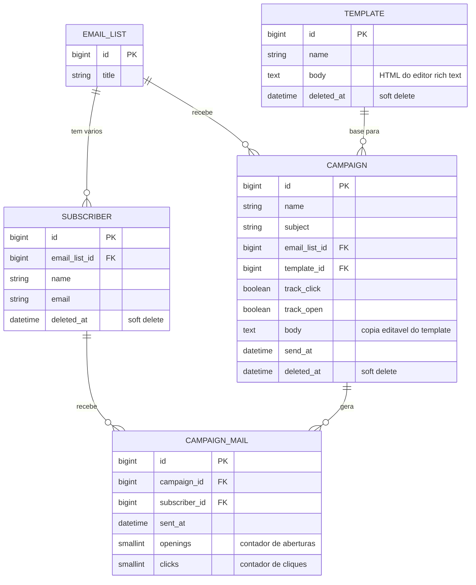

# 📬 BlastMail — Guia de Implementação Passo a Passo

> **Laravel 13 + React 19 + Inertia 3 + Tailwind 4** — do `laravel new` ao deploy no **Laravel Cloud**.

Este guia reconstrói, do zero, o projeto **BlastMail** (curso da Rocketseat — [rocketseat-education/php-blastmail](https://github.com/rocketseat-education/php-blastmail)), uma plataforma de e-mail marketing com listas de assinantes, templates, campanhas, envio assíncrono por filas e rastreamento de aberturas e cliques.

O projeto original foi feito com **Laravel 11 + Breeze + Blade + Alpine.js**. Este guia adapta **todo** o projeto para a stack que você pediu:

| | Projeto original (curso) | Este guia |
|---|---|---|
| Framework | Laravel 11 | **Laravel 13** (lançado em 17/03/2026, requer PHP ≥ 8.3) |
| Autenticação | Laravel Breeze | **Starter kit oficial React** (usa Laravel Fortify por baixo) |
| Frontend | Blade + Alpine.js | **React 19 + Inertia 3 + TypeScript** |
| CSS | Tailwind 3 | **Tailwind 4 + shadcn/ui** |
| Editor rich text | Quill 2 via CDN + Alpine | **Quill 2 via npm em componente React** |
| Banco (dev) | SQLite | SQLite |
| Banco (produção) | — | **Postgres Serverless (Laravel Cloud)** |
| Filas | `database` driver | `database` em dev / **Managed Queue no Laravel Cloud** |
| Deploy | — | **Laravel Cloud** |

---

## 🧠 Como usar este guia (leia primeiro!)

Este guia foi desenhado para ser seguido **uma fase por sessão de estudo**. Cada fase:

- ✅ Tem uma **checklist** no início — marque os itens conforme avança (se estiver lendo no GitHub, copie o arquivo pra um app de notas que suporte checkbox, tipo Obsidian ou Notion, ou marque direto no VS Code).
- 🎯 Tem **pontos de verificação** ("✅ Confira") — pare e teste antes de continuar. Se o checkpoint falhou, não avance: o erro só fica maior depois.
- 💾 Termina com um **commit git** — igual ao curso original. Commitar no fim de cada fase te dá um "save point" pra voltar se algo quebrar.
- ⏱️ Tem uma **estimativa de tempo** — planeje sua sessão. Se a fase for maior que sua janela de foco, pare num checkpoint e commite o que tem com `wip:` no início da mensagem.

**Regra de ouro:** não pule etapas e não escreva dois arquivos ao mesmo tempo. Um arquivo → salva → testa → próximo.

Cada arquivo do projeto aparece assim:

> **📄 `caminho/do/arquivo.php`**
>
> **Por quê?** Um parágrafo explicando o papel do arquivo e por que ele existe.
>
> ```php
> // código completo
> ```

---

## 🗂️ Índice de fases

| Fase | Conteúdo | Tempo estimado |
|---|---|---|
| [Fase 0](#fase-0) | Pré-requisitos e ambiente | 30–60 min |
| [Fase 1](#fase-1) | Criação do projeto + tour pelos arquivos gerados | 1h |
| [Fase 2](#fase-2) | Autenticação e simplificação do esqueleto | 45 min |
| [Fase 3](#fase-3) | Listas de e-mail + upload de CSV + transactions | 2–3h |
| [Fase 4](#fase-4) | Assinantes: busca, paginação, N+1, soft delete | 2h |
| [Fase 5](#fase-5) | Templates de e-mail + editor rich text (Quill) | 2h |
| [Fase 6](#fase-6) | Campanhas: wizard com abas, sessão, middleware, Form Request | 3–4h |
| [Fase 7](#fase-7) | Envio assíncrono: Mailable, Jobs e filas | 2h |
| [Fase 8](#fase-8) | Dashboard da campanha: estatísticas, factories e seeders | 2–3h |
| [Fase 9](#fase-9) | Rastreamento de aberturas (pixel) e cliques | 1–2h |
| [Fase 10](#fase-10) | Revisão final e teste de ponta a ponta | 1h |
| [Fase 11](#fase-11) | Deploy no Laravel Cloud | 1–2h |
| [Apêndices](#apendices) | CSV de exemplo, comandos, mapa de commits | — |

---

## 🗺️ Mapa: commits do curso → fases deste guia

Se você se perder, este mapa liga cada commit do repositório original à seção correspondente aqui. Os commits estão em ordem cronológica (`git log --oneline --reverse` no repo do curso).

| Commit original | Fase aqui |
|---|---|
| `19084c1` Instalando o Laravel | Fase 1 |
| `ea79057` Simplificando o Laravel Breeze | Fase 2 |
| `e290472` Tela inicial da lista de e-mail | Fase 3.3 |
| `8a005c7` Criando uma lista de e-mail | Fase 3.4 |
| `cfec73d` Upload de um arquivo csv | Fase 3.5 |
| `4aa80ef` Protegendo com transactions | Fase 3.6 |
| `7a9def4` Criando novos componentes blade | Fase 3.2 (nossos componentes React) |
| `f8d2842` Pesquisa de listas e paginação | Fase 3.7 |
| `55b21ee` Analisando N+1 | Fase 3.8 |
| `8fc4641` Listagem dos assinantes de uma lista | Fase 4.1 |
| `4f36a07` SoftDelete um assinante | Fase 4.2 |
| `aeb6443` Refatorando blade components | Fase 3.2 (já nasce refatorado em React) |
| `20a6c46` Adicionando um assinante na lista | Fase 4.3 |
| `6b96670` CRUD de templates de e-mail | Fase 5.1–5.3 |
| `1292312` Rich Textarea | Fase 5.4 |
| `679c0ad` Visualizando um template de e-mail | Fase 5.5 |
| `b543d4c` Entendendo melhor seeds e factories | Fase 8.1 |
| `da1c02a` Listagem de campanhas | Fase 6.2 |
| `71bcb02` Restaurando uma campanha | Fase 6.2 |
| `17faf18` Criando as abas | Fase 6.3 |
| `b93760a` Salvando um formulário em sessão | Fase 6.5 |
| `098d078` Mostrando o respectivo formulário em cada aba | Fase 6.4 |
| `e84cab2` Criando um Form Request para transferir a lógica | Fase 6.5 |
| `4dba144` Selecionando listas de e-mails e templates | Fase 6.4 |
| `629c524` Middleware para garantir o processo | Fase 6.6 |
| `684691d` Criando o componente do checkbox | Fase 6.4 |
| `ae2440d` Usando o body do template | Fase 6.5 |
| `37e48c4` Criando o componente de alertas | Fase 6.7 |
| `0c1a60f` Configurando a tela de agendamento | Fase 6.7 |
| `51e914e` Adicionando informações de envio | Fase 6.7 |
| `c511e9d` Testando o formato do nosso e-mail | Fase 7.2 |
| `8e16817` Mandando e-mails de forma assíncrona | Fase 7.3 |
| `0e33881` Criando as rotas para cada elemento do dashboard | Fase 8.2 |
| `c071e80` Organizando as tabs do show | Fase 8.4 |
| `5bfc6e2` Layout do dashboard da campanha | Fase 8.5 |
| `aefe23f` Layout da lista de e-mails abertos | Fase 8.6 |
| `30a5672` Layout da lista de e-mails clicados | Fase 8.6 |
| `56fc3e4` Base de dados de cliques e aberturas | Fase 8.1 |
| `f9f4934` Dados estatísticos | Fase 8.3 |
| `a11d126` Mostrando dados de e-mails abertos e clicados | Fase 8.6 |
| `e1ae21a` Refatorando para scopes | Fase 8.3 |
| `8be6c18` Rastreando a abertura de e-mails | Fase 9.2 |
| `b883073` Estratégia de rastreamento de cliques | Fase 9.3 |
| `dbe8165` Implementação do rastreio de cliques | Fase 9.3 |
| `3db091b` Revisão final | Fase 10 |

---

## 📐 O modelo de dados (visão geral antes de começar)

Entender o desenho inteiro antes de codar ajuda muito a não se perder no meio. O BlastMail tem 5 entidades:



O fluxo do produto: você **importa uma lista** de assinantes via CSV → **cria templates** de e-mail com um editor rich text → **cria uma campanha** (escolhe lista + template, edita o corpo, agenda) → o sistema **enfileira um e-mail por assinante** (`campaign_mails` é o registro individual de cada envio) → cada e-mail carrega um **pixel de rastreamento** (aberturas) e **links reescritos** (cliques) que incrementam contadores → o **dashboard** agrega tudo em estatísticas.

---

<a id="fase-0"></a>
# Fase 0 — Pré-requisitos e ambiente (30–60 min)

### Checklist da fase

- [ ] PHP 8.3+ instalado (`php -v`)
- [ ] Composer 2 instalado (`composer -V`)
- [ ] Node 20+ e npm instalados (`node -v`)
- [ ] Laravel Installer instalado (`laravel --version`)
- [ ] Mailpit rodando (`http://localhost:8025` abre)
- [ ] Git configurado (`git config user.name` retorna seu nome)

### 0.1 PHP, Composer e Node

O **Laravel 13 exige PHP 8.3 ou superior**. O jeito mais simples de ter tudo (PHP + Composer + Node + Laravel Installer) em qualquer sistema é o instalador oficial:

```bash
# macOS / Linux
/bin/bash -c "$(curl -fsSL https://php.new/install/linux)"   # ou /mac

# Windows (PowerShell como administrador)
Invoke-WebRequest -Uri "https://php.new/install/windows" -UseBasicParsing | Invoke-Expression
```

Se você usa **Laravel Herd** (macOS/Windows), ele já traz PHP, Composer, Node e o installer — pode pular este passo. Depois de instalar, **feche e reabra o terminal** e confira:

```bash
php -v        # PHP 8.3.x ou 8.4.x
composer -V   # Composer 2.x
node -v       # v20+ ou v22+
laravel --version
```

Se `laravel` não existir, instale o installer via Composer:

```bash
composer global require laravel/installer
```

### 0.2 Mailpit (caixa de e-mail falsa para desenvolvimento)

O BlastMail é um projeto de **envio de e-mails** — você vai disparar dezenas de e-mails de teste. O **Mailpit** é um servidor SMTP falso que captura tudo localmente e mostra numa interface web, sem enviar nada de verdade (nem correr o risco de spammar alguém).

```bash
# macOS
brew install mailpit && brew services start mailpit

# Linux
curl -sL https://raw.githubusercontent.com/axllent/mailpit/develop/install.sh | sudo bash
mailpit   # deixe rodando num terminal

# Qualquer sistema, via Docker
docker run -d --name mailpit -p 8025:8025 -p 1025:1025 axllent/mailpit
```

> **✅ Confira:** abra `http://localhost:8025` no navegador. Deve aparecer a caixa de entrada vazia do Mailpit. O SMTP dele escuta na porta `1025` — é ela que vai no `.env` do Laravel.

---

<a id="fase-1"></a>
# Fase 1 — Criação do projeto (1h)

> Equivale ao commit `19084c1 — Instalando o Laravel` do curso, mas com o starter kit React em vez do Breeze.

### Checklist da fase

- [ ] Projeto criado com `laravel new blastmail` usando o starter kit **React**
- [ ] `composer run dev` sobe o servidor e o Vite sem erros
- [ ] Tela de login abre em `http://localhost:8000`
- [ ] Consigo registrar um usuário e ver o dashboard
- [ ] `.env` ajustado (nome do app, mail, filas)
- [ ] Entendi o papel de cada arquivo gerado (tour abaixo)
- [ ] Commit: `Instalando o Laravel`

### 1.1 Criando o projeto

```bash
laravel new blastmail
```

O instalador vai fazer perguntas. Responda:

1. **Which starter kit would you like to install?** → `React`
2. **Which authentication provider do you prefer?** → `Laravel's built-in authentication` (usa o Fortify)
3. **Would you like any optional features?** → selecione **Email verification** (o curso usa o middleware `verified`; os extras como Two-factor e Passkeys são opcionais — não os usaremos)
4. **Which testing framework do you prefer?** → `Pest` (é o que o curso usa)
5. **Would you like to run npm install and npm run build?** → `Yes`

O instalador cria o banco SQLite (`database/database.sqlite`), roda as migrations e compila o front. Ao terminar:

```bash
cd blastmail
composer run dev
```

`composer run dev` executa o novo comando `php artisan dev` do Laravel 13, que sobe **quatro processos de uma vez**: o servidor HTTP (`artisan serve`), o worker de filas, o `pail` (logs em tempo real no terminal) e o Vite (hot reload do React). No curso original isso era feito com `concurrently`; no Laravel 13 já vem pronto — e é importante pra gente porque **as filas já ficam rodando**, coisa que usaremos na Fase 7.

> **✅ Confira:** abra `http://localhost:8000`. Você deve ver a página de boas-vindas. Clique em **Register**, crie um usuário (o e-mail de verificação vai cair no Mailpit — abra `http://localhost:8025`, clique no link de verificação) e você deve cair no **Dashboard** com uma sidebar à esquerda.

### 1.2 Tour pelos arquivos gerados (leia, não pule!)

Você não vai *editar* esses arquivos agora, mas precisa saber o que cada um faz — o guia inteiro se apoia neles.

> **📄 `composer.json`**
>
> **Por quê?** É o manifesto PHP do projeto: declara que dependemos do `laravel/framework: ^13.x`, do `inertiajs/inertia-laravel: ^3.0` (a ponte servidor↔React), do `laravel/fortify` (backend de autenticação: login, registro, reset de senha — o starter kit React usa Fortify no lugar do Breeze do curso) e do `laravel/wayfinder` (gera helpers TypeScript para as rotas nomeadas do Laravel). Também define os scripts `composer run dev` e `composer run test`.

> **📄 `package.json`**
>
> **Por quê?** O manifesto JavaScript: React 19, `@inertiajs/react` v3, Tailwind CSS 4 (agora como plugin do Vite, sem `tailwind.config.js` — a configuração vive no próprio CSS), os componentes Radix que alimentam o shadcn/ui, `lucide-react` (ícones) e `sonner` (toasts, que usaremos para as mensagens de sucesso). No curso, o front era só Alpine.js; aqui é uma SPA React de verdade.

> **📄 `vite.config.ts`**
>
> **Por quê?** Configura o build do frontend: o plugin `laravel-vite-plugin` conecta o Vite ao Laravel (sabe onde publicar os assets e faz hot reload), o plugin `react` compila JSX/TSX (com o React Compiler ativado), `tailwindcss()` processa o CSS e `wayfinder()` regenera os helpers de rota TypeScript sempre que você muda um arquivo de rotas PHP.

> **📄 `resources/js/app.tsx`**
>
> **Por quê?** É o ponto de entrada do React. O `createInertiaApp` registra como resolver páginas (cada `Inertia::render('nome')` no PHP vira o arquivo `resources/js/pages/nome.tsx`), aplica o **layout global** (páginas de `auth/` ganham o `AuthLayout`, o resto ganha o `AppLayout` com sidebar — por isso nossas páginas não precisam importar layout manualmente) e monta o `<Toaster />` do sonner, que usaremos para mensagens flash.

> **📄 `app/Http/Middleware/HandleInertiaRequests.php`**
>
> **Por quê?** O coração do Inertia no lado PHP. Toda resposta Inertia passa por aqui, e o método `share()` define **props globais** disponíveis em todas as páginas React (`usePage().props`): o usuário autenticado (`auth.user`), o nome do app etc. Vamos editá-lo na Fase 3 para compartilhar mensagens flash de sessão.

> **📄 `routes/web.php`, `routes/settings.php`, `routes/console.php`**
>
> **Por quê?** `web.php` é onde declararemos todas as rotas do BlastMail. `settings.php` traz as rotas de perfil/senha/aparência que o starter kit já entrega prontas (equivalente ao `ProfileController` do Breeze no curso — ganhamos isso de graça). `console.php` é para comandos agendados (não usaremos).

> **📄 `bootstrap/app.php`**
>
> **Por quê?** Desde o Laravel 11 é aqui (e não mais em `Kernel.php`) que middlewares e exceções são configurados. O starter kit já registra o `HandleInertiaRequests`. Não precisaremos mexer: nosso middleware de campanha (Fase 6) será aplicado direto na rota.

> **📄 `resources/js/pages/`, `resources/js/layouts/`, `resources/js/components/`**
>
> **Por quê?** A convenção do starter kit: `pages/` contém as páginas (uma por `Inertia::render`), `layouts/` os layouts (sidebar, auth), `components/` os componentes reutilizáveis — incluindo `components/ui/`, que são os componentes shadcn/ui (Button, Card, Input, Checkbox, Dialog…) já instalados. Nossos arquivos novos seguirão essa convenção.

> **📄 `database/database.sqlite` + `.env` (`DB_CONNECTION=sqlite`)**
>
> **Por quê?** O Laravel usa SQLite por padrão desde a v11: zero configuração, o banco é um arquivo. Perfeito para desenvolvimento (o curso usa igual). Em produção o Laravel Cloud injeta um Postgres automaticamente (Fase 11) — e como usamos só Eloquent/Query Builder (com um único `selectRaw` compatível), a troca é transparente.

### 1.3 Ajustando o `.env`

> **📄 `.env` (edite estas linhas)**
>
> **Por quê?** O `.env` guarda configuração por ambiente (nunca vai pro git — o `.gitignore` já o exclui). Precisamos: dar nome ao app (aparece no e-mail: "Thanks, BlastMail"), apontar o mailer para o **Mailpit** (para capturar os e-mails localmente) e garantir filas no driver `database` (jobs ficam numa tabela — a migration `jobs` já veio criada). O `MAIL_FROM_ADDRESS` é o remetente que aparecerá nas campanhas.

```dotenv
APP_NAME=BlastMail
APP_URL=http://localhost:8000

QUEUE_CONNECTION=database

MAIL_MAILER=smtp
MAIL_HOST=127.0.0.1
MAIL_PORT=1025
MAIL_USERNAME=null
MAIL_PASSWORD=null
MAIL_FROM_ADDRESS="hello@blastmail.test"
MAIL_FROM_NAME="${APP_NAME}"
```

Depois de mexer no `.env`, reinicie o `composer run dev` (Ctrl+C e sobe de novo) — o processo de fila carrega a config na inicialização.

### 1.4 Commit da fase

```bash
git add -A
git commit -m "Instalando o Laravel"
```

> 💡 O starter kit já iniciou o repositório git na criação do projeto. Se `git status` reclamar que não é um repo, rode `git init` antes.

---

<a id="fase-2"></a>
# Fase 2 — Autenticação e simplificação (45 min)

> Equivale ao commit `ea79057 — Simplificando o Laravel Breeze`. No curso, o Breeze gerava dezenas de views Blade que precisavam ser enxugadas. Com o starter kit React o trabalho é menor: a autenticação (Fortify) já vem organizada. O que faremos é **adaptar o esqueleto ao BlastMail**: tirar a página de boas-vindas, apontar a raiz para o futuro índice de campanhas e preparar a navegação da sidebar.

### Checklist da fase

- [ ] Rota `/` protegida por `auth` + `verified`
- [ ] `/dashboard` redireciona para `/`
- [ ] Sidebar com os 3 itens do BlastMail (Campanhas, Listas, Templates)
- [ ] Página placeholder de campanhas renderiza
- [ ] Commit: `Simplificando o esqueleto de autenticacao`

### 2.1 Rotas base

> **📄 `routes/web.php`**
>
> **Por quê?** No curso, a home (`/`) é a listagem de campanhas e `/dashboard` (destino padrão pós-login do Fortify/Breeze) redireciona para ela. Reproduzimos exatamente isso: a rota `/` fica dentro do grupo `auth` + `verified` (usuário logado **e** com e-mail verificado), e mantemos o **nome** `dashboard` no redirect porque o starter kit (menu do usuário, redirect pós-login do Fortify) referencia a rota `dashboard` pelo nome — assim não quebramos nada. Por enquanto a página de campanhas é um placeholder; ela vira página de verdade na Fase 6.

```php
<?php

use Illuminate\Support\Facades\Route;
use Inertia\Inertia;

Route::middleware(['auth', 'verified'])->group(function () {
    Route::get('/', fn () => Inertia::render('campaigns/index'))->name('campaigns.index');

    Route::redirect('/dashboard', '/')->name('dashboard');
});

require __DIR__.'/settings.php';
```

> ⚠️ **Atenção:** o starter kit trazia `Route::inertia('/', 'welcome')->name('home')` e uma rota `dashboard`. Removemos as duas e **apague também** os arquivos `resources/js/pages/welcome.tsx` e `resources/js/pages/dashboard.tsx` — não existem mais rotas para eles. Se alguma página de auth referenciar a rota `home` (ex.: link "voltar"), troque por `/`.

### 2.2 Página placeholder de campanhas

> **📄 `resources/js/pages/campaigns/index.tsx` (versão temporária)**
>
> **Por quê?** O `Inertia::render('campaigns/index')` precisa de um componente React correspondente em `resources/js/pages/campaigns/index.tsx` — sem ele a rota `/` quebra. Criamos o mínimo agora só para o esqueleto funcionar; a versão completa (tabela, busca, soft delete) substitui este arquivo na Fase 6. O `<Head>` define o `<title>` da aba do navegador, e o objeto `Component.layout` é a convenção do starter kit para passar os breadcrumbs que aparecem no topo da página.

```tsx
import { Head } from '@inertiajs/react';

export default function CampaignsIndex() {
    return (
        <>
            <Head title="Campanhas" />
            <div className="p-4">Em breve: listagem de campanhas 🚀</div>
        </>
    );
}

CampaignsIndex.layout = {
    breadcrumbs: [{ title: 'Campanhas', href: '/' }],
};
```

### 2.3 Navegação da sidebar

> **📄 `resources/js/components/app-sidebar.tsx` (edite o array `mainNavItems`)**
>
> **Por quê?** A sidebar do starter kit é alimentada por um array de itens de navegação. O BlastMail tem três áreas: **Campanhas** (home), **Listas de E-mail** e **Templates** — o equivalente ao menu que o curso montava no `navigation.blade.php`. Os ícones vêm do `lucide-react`, que já está instalado. Localize a constante `mainNavItems` no arquivo e substitua pelos itens abaixo (mantenha o resto do arquivo intacto):

```tsx
import { LayoutPanelTop, Send, Users } from 'lucide-react';
// ... imports existentes ...

const mainNavItems: NavItem[] = [
    {
        title: 'Campanhas',
        href: '/',
        icon: Send,
    },
    {
        title: 'Listas de E-mail',
        href: '/email-list',
        icon: Users,
    },
    {
        title: 'Templates',
        href: '/templates',
        icon: LayoutPanelTop,
    },
];
```

> **✅ Confira:** logado, acesse `http://localhost:8000`. Você deve ver a sidebar com os 3 itens e o texto "Em breve: listagem de campanhas 🚀". Clicar em "Listas de E-mail" dará 404 — normal, a rota nasce na Fase 3.

### 2.4 Commit da fase

```bash
git add -A
git commit -m "Simplificando o esqueleto de autenticacao"
```

---

<a id="fase-3"></a>
# Fase 3 — Listas de e-mail (2–3h)

> Equivale aos commits `e290472` (tela inicial), `8a005c7` (criar lista), `cfec73d` (upload CSV), `4aa80ef` (transactions), `7a9def4`/`aeb6443` (componentes) e `f8d2842`/`55b21ee` (busca, paginação e N+1).

Esta é a fase mais longa porque, além da feature em si, montamos a **infraestrutura compartilhada** que todas as outras telas vão reutilizar: tipos TypeScript, componente de paginação, campo de busca com debounce e mensagens flash com toast. Invista o capricho aqui — as Fases 4, 5, 6 e 8 ficam muito mais rápidas por causa disso.

### Checklist da fase

- [ ] 3.1 Migrations + models `EmailList` e `Subscriber` criados e migrados
- [ ] 3.2 Infra compartilhada: flash/toast, tipos, `Pagination`, `SearchInput`, componente `Table` do shadcn
- [ ] 3.3 Tela `/email-list` lista as listas
- [ ] 3.4 Formulário de criação com título + arquivo
- [ ] 3.5 Upload de CSV cria a lista e os assinantes
- [ ] 3.6 Criação embrulhada em `DB::transaction`
- [ ] 3.7 Busca + paginação funcionando
- [ ] 3.8 N+1 resolvido com `withCount`
- [ ] Commit ao final de cada sub-etapa (sugestões abaixo)

## 3.1 Migrations e Models

```bash
php artisan make:model EmailList -mf
php artisan make:model Subscriber -mf
php artisan make:controller EmailListController --resource --model=EmailList
```

As flags: `-m` gera a migration, `-f` gera a factory (usaremos na Fase 8). O controller nasce como *resource* (com os 7 métodos REST esqueléticos), igual ao curso.

> **📄 `database/migrations/XXXX_XX_XX_XXXXXX_create_email_lists_table.php`**
>
> **Por quê?** Define a tabela `email_lists` no banco. Uma lista é a coisa mais simples possível: um `id` e um `title` ("Newsletter", "Clientes VIP"...). O método `up()` roda no `php artisan migrate`; o `down()` desfaz no rollback. Migrations são o "controle de versão do banco": qualquer pessoa (ou o servidor de produção) reconstrói o schema executando-as em ordem — por isso nunca alteramos uma migration já commitada, criamos outra.

```php
<?php

use Illuminate\Database\Migrations\Migration;
use Illuminate\Database\Schema\Blueprint;
use Illuminate\Support\Facades\Schema;

return new class extends Migration
{
    public function up(): void
    {
        Schema::create('email_lists', function (Blueprint $table) {
            $table->id();
            $table->string('title');
            $table->timestamps();
        });
    }

    public function down(): void
    {
        Schema::dropIfExists('email_lists');
    }
};
```

> **📄 `database/migrations/XXXX_XX_XX_XXXXXX_create_subscribers_table.php`**
>
> **Por quê?** Assinantes pertencem a uma lista, então a tabela carrega a chave estrangeira `email_list_id` — o `foreignId()->constrained()` cria a coluna **e** a constraint no banco (se a lista sumir, o banco impede órfãos). O `softDeletes()` adiciona a coluna `deleted_at`: quando "excluirmos" um assinante (Fase 4), ele não some do banco, só ganha um timestamp — essencial num sistema de e-mail marketing, onde histórico de envio não pode evaporar junto com o assinante.

```php
<?php

use Illuminate\Database\Migrations\Migration;
use Illuminate\Database\Schema\Blueprint;
use Illuminate\Support\Facades\Schema;

return new class extends Migration
{
    public function up(): void
    {
        Schema::create('subscribers', function (Blueprint $table) {
            $table->id();
            $table->foreignId('email_list_id')->constrained();
            $table->string('name');
            $table->string('email');
            $table->timestamps();
            $table->softDeletes();
        });
    }

    public function down(): void
    {
        Schema::dropIfExists('subscribers');
    }
};
```

```bash
php artisan migrate
```

> **📄 `app/Models/EmailList.php`**
>
> **Por quê?** O model Eloquent é a representação PHP da tabela — cada instância é uma linha. O método `subscribers()` declara a relação **1:N** (`hasMany`): a partir de uma lista você navega para os assinantes com `$emailList->subscribers`. Não declaramos `$fillable` porque na Fase 3.6 desabilitaremos a proteção global de mass assignment (como o curso faz — veja a nota lá). O trait `HasFactory` liga o model à factory da Fase 8.

```php
<?php

namespace App\Models;

use Illuminate\Database\Eloquent\Factories\HasFactory;
use Illuminate\Database\Eloquent\Model;
use Illuminate\Database\Eloquent\Relations\HasMany;

class EmailList extends Model
{
    use HasFactory;

    public function subscribers(): HasMany
    {
        return $this->hasMany(Subscriber::class);
    }
}
```

> **📄 `app/Models/Subscriber.php`**
>
> **Por quê?** O outro lado da relação: `belongsTo` permite `$subscriber->emailList`. O trait `SoftDeletes` ativa o comportamento da coluna `deleted_at`: o `->delete()` vira um UPDATE em vez de DELETE, e todas as queries passam a filtrar `whereNull('deleted_at')` automaticamente — a menos que a gente peça os excluídos com `withTrashed()` (Fase 4).

```php
<?php

namespace App\Models;

use Illuminate\Database\Eloquent\Factories\HasFactory;
use Illuminate\Database\Eloquent\Model;
use Illuminate\Database\Eloquent\Relations\BelongsTo;
use Illuminate\Database\Eloquent\SoftDeletes;

class Subscriber extends Model
{
    use HasFactory;
    use SoftDeletes;

    public function emailList(): BelongsTo
    {
        return $this->belongsTo(EmailList::class);
    }
}
```

> **✅ Confira:** `php artisan tinker` e rode `App\Models\EmailList::count()` → deve retornar `0` sem erro (a tabela existe).

💾 `git commit -am "Migrations e models de EmailList e Subscriber"`

## 3.2 Infraestrutura compartilhada do frontend

> No curso, esta etapa era "Criando novos componentes blade" (`7a9def4`) e "Refatorando blade components" (`aeb6443`): card, tabela, form, botões... No nosso caso o shadcn/ui já entrega Button, Card, Input, Label e Checkbox prontos em `resources/js/components/ui/`. Precisamos adicionar **um** componente shadcn que o kit não traz (Table) e criar **quatro** peças nossas: tipos, paginação, busca e o toast de flash.

### a) Componente Table do shadcn/ui

```bash
npx shadcn@latest add table
```

> **📄 `resources/js/components/ui/table.tsx` (gerado pelo comando)**
>
> **Por quê?** O shadcn/ui não é uma biblioteca instalada via npm: o CLI **copia o código-fonte do componente pra dentro do seu projeto** (por isso existe o `components.json` na raiz — ele diz ao CLI onde colar). Você ganha uma tabela estilizada e acessível (`Table`, `TableHeader`, `TableRow`, `TableCell`...) que é 100% sua para editar. Equivale aos componentes `x-table` / `x-table.td` que o curso criou à mão.

### b) Tipos TypeScript do domínio

> **📄 `resources/js/types/blastmail.ts`**
>
> **Por quê?** O Inertia envia os dados do controller como JSON, e o TypeScript não tem como adivinhar o formato. Este arquivo declara **uma vez** a forma de cada entidade (espelhando as colunas das tabelas — repare que relações Eloquent chegam em `snake_case`: `emailList` no PHP vira `email_list` no JSON) e dos paginadores do Laravel: `Paginated<T>` é o shape do `paginate()` (com `links` numerados) e `SimplePaginated<T>` o do `simplePaginate()` (só anterior/próximo, usado na Fase 8). Com isso o editor autocompleta `list.title` e acusa erro se você digitar `list.titel`.

```ts
export interface EmailList {
    id: number;
    title: string;
    subscribers_count?: number;
    created_at: string;
    updated_at: string;
}

export interface Subscriber {
    id: number;
    email_list_id: number;
    name: string;
    email: string;
    deleted_at: string | null;
}

export interface Template {
    id: number;
    name: string;
    body: string;
    deleted_at: string | null;
}

export interface Campaign {
    id: number;
    name: string;
    subject: string;
    email_list_id: number;
    template_id: number;
    track_click: boolean;
    track_open: boolean;
    body: string | null;
    send_at: string | null;
    deleted_at: string | null;
    email_list?: EmailList;
}

export interface CampaignMail {
    id: number;
    campaign_id: number;
    subscriber_id: number;
    sent_at: string | null;
    openings: number;
    clicks: number;
    subscriber?: Subscriber;
}

export interface CampaignStatistics {
    total_openings: number | null;
    total_subscribers: number;
    unique_opens: number;
    openings_rate: number | null;
    total_clicks: number | null;
    unique_clicks: number;
    clicks_rate: number | null;
}

export interface PaginationLink {
    url: string | null;
    label: string;
    active: boolean;
}

export interface Paginated<T> {
    data: T[];
    links: PaginationLink[];
    current_page: number;
    last_page: number;
    per_page: number;
    total: number;
}

export interface SimplePaginated<T> {
    data: T[];
    prev_page_url: string | null;
    next_page_url: string | null;
    current_page: number;
}
```

### c) Componente de paginação

> **📄 `resources/js/components/pagination.tsx`**
>
> **Por quê?** No Blade, `{{ $campaigns->links() }}` renderizava a paginação sozinho. No Inertia esse helper não existe — mas o paginador serializado traz o array `links` (Anterior, 1, 2, 3…, Próximo) com `url`, `label` e `active`, e nós só desenhamos botões. Usamos `<Link>` do Inertia (navegação SPA, sem recarregar a página) com `preserveScroll` para a rolagem não pular ao trocar de página. O `dangerouslySetInnerHTML` é necessário porque os labels "&laquo; Previous" / "Next &raquo;" vêm com entidades HTML do Laravel. Quando há uma página só, o array tem 3 itens (prev, 1, next) e escondemos tudo.

```tsx
import { Link } from '@inertiajs/react';
import { cn } from '@/lib/utils';
import type { PaginationLink } from '@/types/blastmail';

export default function Pagination({ links }: { links: PaginationLink[] }) {
    if (links.length <= 3) {
        return null;
    }

    return (
        <nav className="flex flex-wrap items-center gap-1">
            {links.map((link, index) =>
                link.url ? (
                    <Link
                        key={index}
                        href={link.url}
                        preserveScroll
                        className={cn(
                            'rounded-md border px-3 py-1.5 text-sm',
                            link.active
                                ? 'border-primary bg-primary text-primary-foreground'
                                : 'hover:bg-muted',
                        )}
                        dangerouslySetInnerHTML={{ __html: link.label }}
                    />
                ) : (
                    <span
                        key={index}
                        className="px-3 py-1.5 text-sm text-muted-foreground"
                        dangerouslySetInnerHTML={{ __html: link.label }}
                    />
                ),
            )}
        </nav>
    );
}
```

### d) Campo de busca com debounce

> **📄 `resources/js/components/search-input.tsx`**
>
> **Por quê?** No curso a busca era um `<form>` que submetia no Enter. Em React podemos melhorar sem complicar: a cada tecla, esperamos 400 ms de silêncio (debounce, para não disparar uma request por letra) e fazemos `router.get()` — o Inertia faz uma visita GET à mesma rota com `?search=...`, o controller filtra e devolve as props novas. `preserveState: true` mantém o componente montado (o input não perde o foco) e `replace: true` evita poluir o histórico do navegador com cada tecla. `extraParams` permite carregar junto outros filtros (o `withTrashed` da Fase 4).

```tsx
import { router } from '@inertiajs/react';
import { useRef, useState } from 'react';
import { Input } from '@/components/ui/input';

interface SearchInputProps {
    url: string;
    initialValue?: string | null;
    extraParams?: Record<string, string | number | undefined>;
    placeholder?: string;
    className?: string;
}

export default function SearchInput({
    url,
    initialValue,
    extraParams = {},
    placeholder = 'Pesquisar...',
    className,
}: SearchInputProps) {
    const [value, setValue] = useState(initialValue ?? '');
    const timeout = useRef<ReturnType<typeof setTimeout> | null>(null);

    function handleChange(event: React.ChangeEvent<HTMLInputElement>) {
        const search = event.target.value;
        setValue(search);

        if (timeout.current) {
            clearTimeout(timeout.current);
        }

        timeout.current = setTimeout(() => {
            router.get(
                url,
                { ...extraParams, search: search || undefined },
                { preserveState: true, replace: true },
            );
        }, 400);
    }

    return (
        <Input
            type="search"
            value={value}
            onChange={handleChange}
            placeholder={placeholder}
            className={className}
        />
    );
}
```

### e) Mensagens flash como toast

> **📄 `app/Http/Middleware/HandleInertiaRequests.php` (adicione ao `share()`)**
>
> **Por quê?** No curso, `back()->with('message', ...)` + um componente Blade exibiam a mensagem de sucesso. No Inertia, dados de sessão não chegam ao React sozinhos: precisamos **compartilhá-los como prop global**. A closure (`fn () => ...`) é importante — ela é reavaliada a cada request, então a mensagem aparece uma vez e some (flash de sessão). Acrescente a chave `flash` ao array retornado por `share()`:

```php
public function share(Request $request): array
{
    return [
        ...parent::share($request),
        'name' => config('app.name'),
        'auth' => [
            'user' => $request->user(),
        ],
        'sidebarOpen' => ! $request->hasCookie('sidebar_state') || $request->cookie('sidebar_state') === 'true',
        'flash' => [
            'message' => fn () => $request->session()->get('message'),
        ],
    ];
}
```

> **📄 `resources/js/hooks/use-flash-message.ts`**
>
> **Por quê?** Um hook que observa a prop `flash.message` e, quando ela chega, dispara um toast do **sonner** (o `<Toaster />` já está montado no `app.tsx` do kit). Concentrar isso num hook evita repetir `useEffect` em toda página — chamamos uma única vez, no layout.

```ts
import { usePage } from '@inertiajs/react';
import { useEffect } from 'react';
import { toast } from 'sonner';

interface FlashPageProps {
    flash: { message?: string | null };
    [key: string]: unknown;
}

export function useFlashMessage(): void {
    const { flash } = usePage<FlashPageProps>().props;

    useEffect(() => {
        if (flash?.message) {
            toast.success(flash.message);
        }
    }, [flash?.message]);
}
```

> **📄 `resources/js/layouts/app-layout.tsx` (edite)**
>
> **Por quê?** O layout embrulha todas as páginas autenticadas — é o único lugar onde o hook precisa ser chamado para valer no app inteiro. Versão editada completa:

```tsx
import { useFlashMessage } from '@/hooks/use-flash-message';
import AppLayoutTemplate from '@/layouts/app/app-sidebar-layout';
import type { BreadcrumbItem } from '@/types';

export default function AppLayout({
    breadcrumbs = [],
    children,
}: {
    breadcrumbs?: BreadcrumbItem[];
    children: React.ReactNode;
}) {
    useFlashMessage();

    return (
        <AppLayoutTemplate breadcrumbs={breadcrumbs}>
            {children}
        </AppLayoutTemplate>
    );
}
```

💾 `git commit -am "Componentes compartilhados do frontend"`

## 3.3 Tela inicial da lista de e-mail

### Rotas

> **📄 `routes/web.php` (adicione dentro do grupo `auth`/`verified`)**
>
> **Por quê?** Três rotas, iguais às do curso: listar, mostrar o formulário e receber o POST. Repare que o curso registra o POST **na mesma URL** do formulário (`/email-list/create`) e sem nome — mantivemos. O nome `email-list.index` será usado nos redirects do controller.

```php
use App\Http\Controllers\EmailListController;

// ... dentro do grupo Route::middleware(['auth', 'verified']) ...
Route::get('/email-list', [EmailListController::class, 'index'])->name('email-list.index');
Route::get('/email-list/create', [EmailListController::class, 'create'])->name('email-list.create');
Route::post('/email-list/create', [EmailListController::class, 'store']);
```

### Controller (versão inicial)

> **📄 `app/Http/Controllers/EmailListController.php` — métodos `index` e `create`**
>
> **Por quê?** Onde o curso fazia `return view('email-list.index', [...])`, nós fazemos `Inertia::render('email-lists/index', [...])`: o Inertia serializa o segundo argumento como **props** e renderiza o componente React `resources/js/pages/email-lists/index.tsx`. Esta é a tradução central de Blade→Inertia do guia inteiro: controller idêntico ao do curso, só muda a "view". A versão com busca/`withCount` entra nos passos 3.7/3.8; comece simples:

```php
<?php

namespace App\Http\Controllers;

use App\Models\EmailList;
use Inertia\Inertia;
use Inertia\Response;

class EmailListController extends Controller
{
    public function index(): Response
    {
        return Inertia::render('email-lists/index', [
            'emailLists' => EmailList::query()->paginate(5),
            'search' => null,
        ]);
    }

    public function create(): Response
    {
        return Inertia::render('email-lists/create');
    }

    // store() entra no passo 3.5
}
```

### Página de listagem

> **📄 `resources/js/pages/email-lists/index.tsx`**
>
> **Por quê?** A tradução React da view `email-list/index.blade.php` do curso, com os mesmos comportamentos: estado vazio ("Crie sua primeira lista") quando não há listas nem busca ativa; senão, botão de criar + busca + tabela (`#`, título, nº de assinantes, ação "Assinantes") + paginação. `subscribers_count` só passa a existir no passo 3.8 (`withCount`) — até lá a coluna fica vazia, sem erro, porque o tipo a declara opcional. O componente exporta `layout.breadcrumbs`, convenção do starter kit para o cabeçalho da página.

```tsx
import { Head, Link } from '@inertiajs/react';
import Pagination from '@/components/pagination';
import SearchInput from '@/components/search-input';
import { Button } from '@/components/ui/button';
import { Card, CardContent } from '@/components/ui/card';
import {
    Table,
    TableBody,
    TableCell,
    TableHead,
    TableHeader,
    TableRow,
} from '@/components/ui/table';
import type { EmailList, Paginated } from '@/types/blastmail';

interface Props {
    emailLists: Paginated<EmailList>;
    search: string | null;
}

export default function EmailListsIndex({ emailLists, search }: Props) {
    const isEmpty = emailLists.data.length === 0 && !search;

    return (
        <>
            <Head title="Listas de E-mail" />

            <div className="p-4">
                <Card>
                    <CardContent className="space-y-4">
                        {isEmpty ? (
                            <div className="flex justify-center py-10">
                                <Button asChild>
                                    <Link href="/email-list/create">
                                        Crie sua primeira lista de e-mail
                                    </Link>
                                </Button>
                            </div>
                        ) : (
                            <>
                                <div className="flex items-center justify-between gap-4">
                                    <Button asChild>
                                        <Link href="/email-list/create">
                                            Criar nova lista
                                        </Link>
                                    </Button>

                                    <SearchInput
                                        url="/email-list"
                                        initialValue={search}
                                        className="w-2/5"
                                    />
                                </div>

                                <Table>
                                    <TableHeader>
                                        <TableRow>
                                            <TableHead className="w-12">#</TableHead>
                                            <TableHead>Lista</TableHead>
                                            <TableHead className="w-32"># Assinantes</TableHead>
                                            <TableHead className="w-32">Ações</TableHead>
                                        </TableRow>
                                    </TableHeader>
                                    <TableBody>
                                        {emailLists.data.map((list) => (
                                            <TableRow key={list.id}>
                                                <TableCell>{list.id}</TableCell>
                                                <TableCell>{list.title}</TableCell>
                                                <TableCell>{list.subscribers_count}</TableCell>
                                                <TableCell>
                                                    <Button variant="secondary" size="sm" asChild>
                                                        <Link href={`/email-list/${list.id}/subscribers`}>
                                                            Assinantes
                                                        </Link>
                                                    </Button>
                                                </TableCell>
                                            </TableRow>
                                        ))}
                                    </TableBody>
                                </Table>

                                <Pagination links={emailLists.links} />
                            </>
                        )}
                    </CardContent>
                </Card>
            </div>
        </>
    );
}

EmailListsIndex.layout = {
    breadcrumbs: [{ title: 'Listas de E-mail', href: '/email-list' }],
};
```

> **✅ Confira:** acesse `/email-list`. Deve aparecer o card com "Crie sua primeira lista de e-mail".

💾 `git commit -am "Tela inicial da lista de e-mail"`

## 3.4 Formulário de criação

> **📄 `resources/js/pages/email-lists/create.tsx`**
>
> **Por quê?** A tradução da view `email-list/create.blade.php`: campo de título + campo de arquivo CSV. Aqui entra o hook mais importante do Inertia, o **`useForm`**: ele guarda os dados, envia o POST, expõe `processing` (para desabilitar o botão durante o envio) e `errors` (os erros de validação do Laravel chegam **automaticamente**, sem escrever uma linha de API). Como um dos campos é um `File`, o Inertia detecta e envia como `multipart/form-data` sozinho — no Blade era preciso lembrar do `enctype`. O erro de validação de cada campo aparece logo abaixo dele, como no `x-input-error` do curso.

```tsx
import { Head, useForm } from '@inertiajs/react';
import InputError from '@/components/input-error';
import { Button } from '@/components/ui/button';
import { Card, CardContent } from '@/components/ui/card';
import { Input } from '@/components/ui/input';
import { Label } from '@/components/ui/label';

export default function EmailListsCreate() {
    const { data, setData, post, processing, errors } = useForm<{
        title: string;
        file: File | null;
    }>({
        title: '',
        file: null,
    });

    function submit(event: React.FormEvent) {
        event.preventDefault();
        post('/email-list/create');
    }

    return (
        <>
            <Head title="Criar lista de e-mail" />

            <div className="p-4">
                <Card>
                    <CardContent>
                        <form onSubmit={submit} className="space-y-6">
                            <div className="grid gap-2">
                                <Label htmlFor="title">Título</Label>
                                <Input
                                    id="title"
                                    value={data.title}
                                    onChange={(e) => setData('title', e.target.value)}
                                    autoFocus
                                />
                                <InputError message={errors.title} />
                            </div>

                            <div className="grid gap-2">
                                <Label htmlFor="file">Arquivo da lista (CSV)</Label>
                                <Input
                                    id="file"
                                    type="file"
                                    accept=".csv"
                                    onChange={(e) =>
                                        setData('file', e.target.files?.[0] ?? null)
                                    }
                                />
                                <InputError message={errors.file} />
                            </div>

                            <div className="flex items-center gap-4">
                                <Button variant="secondary" type="reset">
                                    Cancelar
                                </Button>
                                <Button type="submit" disabled={processing}>
                                    Salvar
                                </Button>
                            </div>
                        </form>
                    </CardContent>
                </Card>
            </div>
        </>
    );
}

EmailListsCreate.layout = {
    breadcrumbs: [
        { title: 'Listas de E-mail', href: '/email-list' },
        { title: 'Criar nova lista', href: '/email-list/create' },
    ],
};
```

💾 `git commit -am "Criando uma lista de e-mail"`

## 3.5 Upload e leitura do CSV

Antes de codar, crie um CSV de teste (há um maior no [Apêndice A](#apendices)):

```csv
Name,Email
Ana Souza,ana@example.com
Bruno Lima,bruno@example.com
Carla Dias,carla@example.com
```

> **📄 `app/Http/Controllers/EmailListController.php` — `store()` + `getEmailsFromCsvFile()`**
>
> **Por quê?** O `store` valida (`title` obrigatório; `file` obrigatório, precisa ser um upload válido e ter mime `csv`), extrai os e-mails do arquivo e cria lista + assinantes. A leitura usa as funções nativas de CSV do PHP — `fopen` no caminho temporário do upload e `fgetcsv` linha a linha (que já lida com vírgulas dentro de aspas, coisa que um `explode(',')` erraria). A primeira linha (`Name,Email`) é o cabeçalho e é pulada. O `createMany` na relação insere todos os assinantes **já com o `email_list_id` preenchido** — é a vantagem de criar através da relação em vez de `Subscriber::create` solto.

```php
<?php

namespace App\Http\Controllers;

use App\Models\EmailList;
use Illuminate\Http\RedirectResponse;
use Illuminate\Http\Request;
use Illuminate\Http\UploadedFile;
use Inertia\Inertia;
use Inertia\Response;

class EmailListController extends Controller
{
    // index() e create() como antes...

    public function store(Request $request): RedirectResponse
    {
        $request->validate([
            'title' => ['required', 'max:255'],
            'file' => ['required', 'file', 'mimes:csv'],
        ]);

        $emails = $this->getEmailsFromCsvFile($request->file('file'));

        $emailList = EmailList::query()->create(['title' => $request->title]);

        $emailList->subscribers()->createMany($emails);

        return to_route('email-list.index')
            ->with('message', 'Lista de e-mail criada com sucesso!');
    }

    private function getEmailsFromCsvFile(UploadedFile $file): array
    {
        $fileHandle = fopen($file->getRealPath(), 'r');
        $items = [];

        while (($row = fgetcsv($fileHandle, null, ',')) !== false) {
            if ($row[0] == 'Name' && $row[1] == 'Email') {
                continue;
            }

            $items[] = [
                'name' => $row[0],
                'email' => $row[1],
            ];
        }

        fclose($fileHandle);

        return $items;
    }
}
```

> ⚠️ **Mass assignment:** `EmailList::create([...])` vai lançar `MassAssignmentException`, porque não declaramos `$fillable` no model. O curso resolve liberando globalmente no service provider — próximo arquivo.

> **📄 `app/Providers/AppServiceProvider.php` (adicione no `boot()`)**
>
> **Por quê?** `Model::unguard()` desliga a proteção de mass assignment de **todos** os models, eliminando a burocracia do `$fillable` — abordagem que o curso adota e que a própria documentação do Laravel aceita, **desde que** você nunca passe `$request->all()` direto para `create()`/`update()`. Repare que em todo o projeto só passamos dados **validados** (`$request->validate(...)` retorna apenas os campos das regras), então a proteção que importa continua de pé.

```php
use Illuminate\Database\Eloquent\Model;

public function boot(): void
{
    Model::unguard();
}
```

> **✅ Confira:** crie uma lista com o CSV de teste. Você deve voltar para `/email-list`, ver o **toast verde** "Lista de e-mail criada com sucesso!" (nossa infra da 3.2 funcionando) e a lista na tabela. No tinker: `App\Models\Subscriber::count()` → `3`.

💾 `git commit -am "Upload de um arquivo csv"`

## 3.6 Protegendo com transactions

> **📄 `app/Http/Controllers/EmailListController.php` — `store()` (versão final)**
>
> **Por quê?** Imagine um CSV de 5.000 linhas em que a linha 3.201 está corrompida: sem transação, a lista e 3.200 assinantes já teriam sido gravados — banco inconsistente. `DB::transaction()` embrulha as duas operações num tudo-ou-nada: se **qualquer** exceção estourar dentro da closure, o Laravel faz rollback automático e nada é persistido; se ela terminar, faz commit. É a mesma lição do commit `4aa80ef` do curso. Substitua o miolo do `store`:

```php
use Illuminate\Support\Facades\DB;

public function store(Request $request): RedirectResponse
{
    $request->validate([
        'title' => ['required', 'max:255'],
        'file' => ['required', 'file', 'mimes:csv'],
    ]);

    $emails = $this->getEmailsFromCsvFile($request->file('file'));

    DB::transaction(function () use ($request, $emails) {
        $emailList = EmailList::query()->create(['title' => $request->title]);

        $emailList->subscribers()->createMany($emails);
    });

    return to_route('email-list.index')
        ->with('message', 'Lista de e-mail criada com sucesso!');
}
```

💾 `git commit -am "Protegendo com transactions"`

## 3.7 Pesquisa e paginação

> **📄 `app/Http/Controllers/EmailListController.php` — `index()` (com busca)**
>
> **Por quê?** O `SearchInput` da 3.2 manda `?search=...`; o controller filtra com `when()` — o callback só entra na query se `$search` tiver valor, mantendo a query limpa sem `if`s. Buscamos por título (`LIKE %...%`) **ou** id exato (digitar "7" acha a lista 7). O `paginate(5)` limita a 5 por página (proposital no curso, para a paginação aparecer logo), e o **`appends`** é o detalhe que sempre esquece: ele propaga o `?search=` para os links de página — sem ele, clicar na página 2 perderia o filtro. Devolvemos `search` como prop para o input abrir preenchido.

```php
use Illuminate\Contracts\Database\Eloquent\Builder;
use Illuminate\Http\Request;

public function index(Request $request): Response
{
    $search = $request->get('search');

    return Inertia::render('email-lists/index', [
        'emailLists' => EmailList::query()
            ->when($search, fn (Builder $query) => $query
                ->where('title', 'like', "%{$search}%")
                ->orWhere('id', '=', $search))
            ->paginate(5)
            ->appends(compact('search')),
        'search' => $search,
    ]);
}
```

> **✅ Confira:** crie mais 5 listas (pode repetir o CSV). A paginação deve aparecer com 2 páginas. Digite no campo de busca e veja a tabela filtrar sozinha após uma pausa de digitação; navegue para a página 2 com uma busca ativa e confirme que o filtro se mantém (olhe a URL: `?search=...&page=2`).

💾 `git commit -am "Pesquisa de listas e paginacao"`

## 3.8 Analisando o N+1

> **📄 `app/Http/Controllers/EmailListController.php` — `index()` (versão final, com `withCount`)**
>
> **Por quê?** A coluna "# Assinantes" precisa do total de cada lista. A forma ingênua — `$list->subscribers->count()` na view — dispara **uma query por linha da tabela** (1 para as listas + N para os contadores: o famoso **N+1**, tema do commit `55b21ee`; o curso usa o Debugbar para visualizar, nós podemos ver as queries no `pail`, que está rodando no `composer run dev`). A correção é `withCount('subscribers')`: o Eloquent adiciona um subselect `COUNT(*)` na própria query principal e materializa o atributo `subscribers_count` — exatamente o campo que a página React já exibe. **Uma** query, qualquer que seja o número de listas.

```php
public function index(Request $request): Response
{
    $search = $request->get('search');

    return Inertia::render('email-lists/index', [
        'emailLists' => EmailList::query()
            ->withCount('subscribers')
            ->when($search, fn (Builder $query) => $query
                ->where('title', 'like', "%{$search}%")
                ->orWhere('id', '=', $search))
            ->paginate(5)
            ->appends(compact('search')),
        'search' => $search,
    ]);
}
```

> **✅ Confira:** a coluna "# Assinantes" agora mostra os totais.

💾 `git commit -am "Analisando N+1"`

---

<a id="fase-4"></a>
# Fase 4 — Assinantes (2h)

> Equivale aos commits `8fc4641` (listagem dos assinantes), `4f36a07` (soft delete) e `20a6c46` (adicionar assinante).

### Checklist da fase

- [ ] 4.1 `/email-list/{id}/subscribers` lista os assinantes com busca e paginação
- [ ] 4.2 Excluir assinante (soft delete) + checkbox "mostrar excluídos" + badge "Excluído"
- [ ] 4.3 Adicionar assinante manualmente, com e-mail único **por lista**
- [ ] Commits ao final de cada sub-etapa

## 4.1 Listagem dos assinantes de uma lista

```bash
php artisan make:controller SubscriberController
```

### Rotas

> **📄 `routes/web.php` (adicione dentro do grupo `auth`/`verified`)**
>
> **Por quê?** As rotas de assinantes são **aninhadas** na lista (`/email-list/{emailList}/subscribers`), porque um assinante só existe no contexto de uma lista. O Laravel resolve o `{emailList}` sozinho via **route model binding**: o tipo `EmailList $emailList` no controller faz o framework buscar o registro pelo id da URL (404 automático se não existir). A rota `destroy` já entra aqui para a etapa 4.2.

```php
use App\Http\Controllers\SubscriberController;

// ... dentro do grupo ...
Route::get('/email-list/{emailList}/subscribers', [SubscriberController::class, 'index'])->name('subscribers.index');
Route::get('/email-list/{emailList}/subscribers/create', [SubscriberController::class, 'create'])->name('subscribers.create');
Route::post('/email-list/{emailList}/subscribers/create', [SubscriberController::class, 'store']);
Route::delete('/email-list/{emailList}/subscribers/{subscriber}', [SubscriberController::class, 'destroy'])->name('subscribers.destroy');
```

### Controller

> **📄 `app/Http/Controllers/SubscriberController.php`**
>
> **Por quê?** O `index` parte **da relação** (`$emailList->subscribers()`) — só assinantes daquela lista — e reaproveita o padrão da Fase 3: `when()` para busca e `paginate()` (aqui sem argumento = 15 por página, como no curso). Dois detalhes novos: **(1)** o filtro `withTrashed` — se o usuário marcar o checkbox, a query inclui os soft-deletados; **(2)** a busca embrulha os dois `orWhere` num `where(fn ($q) => ...)`, gerando `AND (name LIKE ... OR email LIKE ...)` — sem os parênteses, o `OR` "vazaria" e furaria o filtro da lista e o do soft delete (bug clássico!). O curso usa os atalhos `whereLike`/`orWhereLike` (Laravel 11.28+), mantidos aqui. O `store` valida com `Rule::unique(...)->where('email_list_id', ...)`: o mesmo e-mail **pode** existir em listas diferentes, mas não duplicado na mesma lista. O `destroy` recebe `mixed $list` sem usar — a rota tem dois parâmetros e só precisamos do segundo; o soft delete do model faz o resto.

```php
<?php

namespace App\Http\Controllers;

use App\Models\EmailList;
use App\Models\Subscriber;
use Illuminate\Contracts\Database\Eloquent\Builder;
use Illuminate\Http\RedirectResponse;
use Illuminate\Http\Request;
use Illuminate\Validation\Rule;
use Inertia\Inertia;
use Inertia\Response;

class SubscriberController extends Controller
{
    public function index(Request $request, EmailList $emailList): Response
    {
        $search = $request->get('search');

        $withTrashed = $request->boolean('withTrashed');

        return Inertia::render('subscribers/index', [
            'emailList' => $emailList,
            'subscribers' => $emailList
                ->subscribers()
                ->when($withTrashed, fn (Builder $query) => $query->withTrashed())
                ->when($search, fn (Builder $query) => $query
                    ->where(fn ($q) => $q
                        ->whereLike('name', "%{$search}%")
                        ->orWhereLike('email', "%{$search}%")))
                ->paginate()
                ->appends(compact('search', 'withTrashed')),
            'search' => $search,
            'withTrashed' => $withTrashed,
        ]);
    }

    public function create(EmailList $emailList): Response
    {
        return Inertia::render('subscribers/create', [
            'emailList' => $emailList,
        ]);
    }

    public function store(Request $request, EmailList $emailList): RedirectResponse
    {
        $data = $request->validate([
            'name' => ['required', 'string', 'max:255'],
            'email' => [
                'required',
                'email',
                'max:255',
                Rule::unique('subscribers')->where('email_list_id', $emailList->id),
            ],
        ]);

        $emailList->subscribers()->create($data);

        return to_route('subscribers.index', $emailList)
            ->with('message', 'Assinante criado com sucesso!');
    }

    public function destroy(mixed $list, Subscriber $subscriber): RedirectResponse
    {
        $subscriber->delete();

        return back()->with('message', 'Assinante removido da lista!');
    }
}
```

### Página de listagem (já com soft delete — etapa 4.2 embutida)

> **📄 `resources/js/pages/subscribers/index.tsx`**
>
> **Por quê?** Tradução da view `subscribers/index.blade.php` com todos os comportamentos do curso: botão de adicionar, checkbox "Mostrar registros excluídos", busca, tabela e paginação. O checkbox dispara um `router.get` imediato (no Blade, o Alpine fazia `$refs.form.submit()`); a busca carrega o `withTrashed` atual via `extraParams`, para os filtros não se atropelarem. A exclusão usa `router.delete` com `confirm()` nativo — fiel ao `onsubmit="return confirm(...)"` do curso — e `preserveScroll` para a página não pular para o topo. Assinante excluído não mostra botão: mostra um **badge "Excluído"** (o `deleted_at` chega preenchido quando `withTrashed` está ativo).

```tsx
import { Head, Link, router } from '@inertiajs/react';
import Pagination from '@/components/pagination';
import SearchInput from '@/components/search-input';
import { Badge } from '@/components/ui/badge';
import { Button } from '@/components/ui/button';
import { Card, CardContent } from '@/components/ui/card';
import { Checkbox } from '@/components/ui/checkbox';
import {
    Table,
    TableBody,
    TableCell,
    TableHead,
    TableHeader,
    TableRow,
} from '@/components/ui/table';
import type { EmailList, Paginated, Subscriber } from '@/types/blastmail';

interface Props {
    emailList: EmailList;
    subscribers: Paginated<Subscriber>;
    search: string | null;
    withTrashed: boolean;
}

export default function SubscribersIndex({
    emailList,
    subscribers,
    search,
    withTrashed,
}: Props) {
    function toggleTrashed(checked: boolean) {
        router.get(
            `/email-list/${emailList.id}/subscribers`,
            { search: search || undefined, withTrashed: checked ? 1 : undefined },
            { preserveState: true },
        );
    }

    function destroy(subscriber: Subscriber) {
        if (!confirm('Tem certeza?')) {
            return;
        }

        router.delete(
            `/email-list/${emailList.id}/subscribers/${subscriber.id}`,
            { preserveScroll: true },
        );
    }

    return (
        <>
            <Head title={`Assinantes — ${emailList.title}`} />

            <div className="p-4">
                <Card>
                    <CardContent className="space-y-4">
                        <div className="flex items-center justify-between gap-4">
                            <Button asChild>
                                <Link href={`/email-list/${emailList.id}/subscribers/create`}>
                                    Adicionar assinante
                                </Link>
                            </Button>

                            <div className="flex w-3/5 items-center gap-4">
                                <label className="flex shrink-0 items-center gap-2 text-sm">
                                    <Checkbox
                                        checked={withTrashed}
                                        onCheckedChange={(checked) =>
                                            toggleTrashed(checked === true)
                                        }
                                    />
                                    Mostrar registros excluídos
                                </label>

                                <SearchInput
                                    url={`/email-list/${emailList.id}/subscribers`}
                                    initialValue={search}
                                    extraParams={{ withTrashed: withTrashed ? 1 : undefined }}
                                    className="w-full"
                                />
                            </div>
                        </div>

                        <Table>
                            <TableHeader>
                                <TableRow>
                                    <TableHead className="w-12">#</TableHead>
                                    <TableHead>Nome</TableHead>
                                    <TableHead>E-mail</TableHead>
                                    <TableHead className="w-32">Ações</TableHead>
                                </TableRow>
                            </TableHeader>
                            <TableBody>
                                {subscribers.data.map((subscriber) => (
                                    <TableRow key={subscriber.id}>
                                        <TableCell>{subscriber.id}</TableCell>
                                        <TableCell>{subscriber.name}</TableCell>
                                        <TableCell>{subscriber.email}</TableCell>
                                        <TableCell>
                                            {subscriber.deleted_at ? (
                                                <Badge variant="destructive">Excluído</Badge>
                                            ) : (
                                                <Button
                                                    variant="secondary"
                                                    size="sm"
                                                    onClick={() => destroy(subscriber)}
                                                >
                                                    Excluir
                                                </Button>
                                            )}
                                        </TableCell>
                                    </TableRow>
                                ))}
                            </TableBody>
                        </Table>

                        <Pagination links={subscribers.links} />
                    </CardContent>
                </Card>
            </div>
        </>
    );
}

SubscribersIndex.layout = {
    breadcrumbs: [{ title: 'Listas de E-mail', href: '/email-list' }],
};
```

> **✅ Confira:** clique em "Assinantes" numa lista. Os assinantes do CSV devem aparecer. Busque por um nome, exclua um assinante (some da tabela + toast), marque "Mostrar registros excluídos" (ele reaparece com o badge vermelho).

💾 `git commit -am "Listagem dos assinantes e soft delete"`

## 4.3 Adicionando um assinante manualmente

> **📄 `resources/js/pages/subscribers/create.tsx`**
>
> **Por quê?** Nem todo assinante entra por CSV — o formulário manual cobre o caso avulso. Mesmo padrão do `useForm` da Fase 3.4, agora com dois campos de texto. Se você tentar cadastrar um e-mail que já existe **nesta** lista, o erro da regra `unique` aparece embaixo do campo — teste isso de propósito para ver a validação do Laravel viajando até o React sem esforço.

```tsx
import { Head, useForm } from '@inertiajs/react';
import InputError from '@/components/input-error';
import { Button } from '@/components/ui/button';
import { Card, CardContent } from '@/components/ui/card';
import { Input } from '@/components/ui/input';
import { Label } from '@/components/ui/label';
import type { EmailList } from '@/types/blastmail';

interface Props {
    emailList: EmailList;
}

export default function SubscribersCreate({ emailList }: Props) {
    const { data, setData, post, processing, errors } = useForm({
        name: '',
        email: '',
    });

    function submit(event: React.FormEvent) {
        event.preventDefault();
        post(`/email-list/${emailList.id}/subscribers/create`);
    }

    return (
        <>
            <Head title={`Adicionar assinante — ${emailList.title}`} />

            <div className="p-4">
                <Card>
                    <CardContent>
                        <form onSubmit={submit} className="space-y-6">
                            <div className="grid gap-2">
                                <Label htmlFor="name">Nome</Label>
                                <Input
                                    id="name"
                                    value={data.name}
                                    onChange={(e) => setData('name', e.target.value)}
                                    autoFocus
                                />
                                <InputError message={errors.name} />
                            </div>

                            <div className="grid gap-2">
                                <Label htmlFor="email">E-mail</Label>
                                <Input
                                    id="email"
                                    type="email"
                                    value={data.email}
                                    onChange={(e) => setData('email', e.target.value)}
                                />
                                <InputError message={errors.email} />
                            </div>

                            <div className="flex items-center gap-4">
                                <Button variant="secondary" type="reset">
                                    Cancelar
                                </Button>
                                <Button type="submit" disabled={processing}>
                                    Salvar
                                </Button>
                            </div>
                        </form>
                    </CardContent>
                </Card>
            </div>
        </>
    );
}

SubscribersCreate.layout = {
    breadcrumbs: [{ title: 'Listas de E-mail', href: '/email-list' }],
};
```

> **✅ Confira:** adicione um assinante novo (funciona, toast aparece) e depois tente adicionar o **mesmo e-mail de novo** — deve aparecer o erro de validação embaixo do campo.

💾 `git commit -am "Adicionando um assinante na lista de e-mail"`

---

<a id="fase-5"></a>
# Fase 5 — Templates de e-mail (2h)

> Equivale aos commits `6b96670` (CRUD de templates), `1292312` (Rich Textarea) e `679c0ad` (visualizando um template).

O template é o "molde" reutilizável do corpo do e-mail. Quando você criar uma campanha (Fase 6), escolherá um template como ponto de partida e poderá editá-lo só para aquela campanha.

### Checklist da fase

- [ ] 5.1 Model + migration + rotas resource
- [ ] 5.2 Controller completo (index/create/store/show/edit/update/destroy)
- [ ] 5.3 Páginas de listagem, criação e edição
- [ ] 5.4 Editor rich text (Quill) funcionando
- [ ] 5.5 Preview do template renderizando HTML
- [ ] Commit: `CRUD de templates de e-mail`

## 5.1 Model, migration e rotas

```bash
php artisan make:model Template -mf
php artisan make:controller TemplateController --resource --model=Template
```

> **📄 `database/migrations/XXXX_XX_XX_XXXXXX_create_templates_table.php`**
>
> **Por quê?** Um template tem `name` (identificação interna) e `body` — do tipo `text`, porque guardará o **HTML** gerado pelo editor rich text, que estoura fácil os 255 caracteres de uma `string`. `softDeletes()` de novo: um template usado por campanhas antigas não pode sumir de verdade (inclusive há uma foreign key de `campaigns` para cá na Fase 6).

```php
<?php

use Illuminate\Database\Migrations\Migration;
use Illuminate\Database\Schema\Blueprint;
use Illuminate\Support\Facades\Schema;

return new class extends Migration
{
    public function up(): void
    {
        Schema::create('templates', function (Blueprint $table) {
            $table->id();
            $table->string('name');
            $table->text('body');
            $table->timestamps();
            $table->softDeletes();
        });
    }

    public function down(): void
    {
        Schema::dropIfExists('templates');
    }
};
```

```bash
php artisan migrate
```

> **📄 `app/Models/Template.php`**
>
> **Por quê?** Model mínimo: sem relações declaradas (a relação campanha→template é navegada só do lado da campanha) e com `SoftDeletes`. É o model mais simples do projeto — nem por isso deixa de merecer arquivo próprio: a tabela `templates` só "existe" para o Eloquent por causa dele.

```php
<?php

namespace App\Models;

use Illuminate\Database\Eloquent\Factories\HasFactory;
use Illuminate\Database\Eloquent\Model;
use Illuminate\Database\Eloquent\SoftDeletes;

class Template extends Model
{
    use HasFactory;
    use SoftDeletes;
}
```

> **📄 `routes/web.php` (adicione dentro do grupo)**
>
> **Por quê?** `Route::resource` registra as 7 rotas RESTful de uma vez (`templates.index`, `.create`, `.store`, `.show`, `.edit`, `.update`, `.destroy`) — o curso usa exatamente isso. Você pode conferir o que foi registrado com `php artisan route:list --name=templates`.

```php
use App\Http\Controllers\TemplateController;

// ... dentro do grupo ...
Route::resource('templates', TemplateController::class);
```

## 5.2 Controller

> **📄 `app/Http/Controllers/TemplateController.php`**
>
> **Por quê?** O CRUD completo, no mesmo padrão que você já domina das Fases 3–4: `index` com busca + `withTrashed` + paginação (o curso usa `paginate(2)` de propósito, para exercitar a paginação — mantido); `store`/`update` validam `name` e `body`; `destroy` faz soft delete. No `update`, o curso usa `fill($data)` + `save()` em vez de `update($data)` — são equivalentes; mantivemos o `fill/save` para ficar igual. Cada ação de escrita flasha uma `message`, que vira toast no front.

```php
<?php

namespace App\Http\Controllers;

use App\Models\Template;
use Illuminate\Contracts\Database\Eloquent\Builder;
use Illuminate\Http\RedirectResponse;
use Illuminate\Http\Request;
use Inertia\Inertia;
use Inertia\Response;

class TemplateController extends Controller
{
    public function index(Request $request): Response
    {
        $search = $request->get('search');

        $withTrashed = $request->boolean('withTrashed');

        return Inertia::render('templates/index', [
            'templates' => Template::query()
                ->when($withTrashed, fn (Builder $query) => $query->withTrashed())
                ->when($search, fn (Builder $query) => $query
                    ->where('name', 'like', "%{$search}%")
                    ->orWhere('id', '=', $search))
                ->paginate(2)
                ->appends(compact('search', 'withTrashed')),
            'search' => $search,
            'withTrashed' => $withTrashed,
        ]);
    }

    public function create(): Response
    {
        return Inertia::render('templates/create');
    }

    public function store(Request $request): RedirectResponse
    {
        $data = $request->validate([
            'name' => ['required', 'string', 'max:255'],
            'body' => ['required'],
        ]);

        Template::create($data);

        return to_route('templates.index')
            ->with('message', 'Template criado com sucesso!');
    }

    public function show(Template $template): Response
    {
        return Inertia::render('templates/show', [
            'template' => $template,
        ]);
    }

    public function edit(Template $template): Response
    {
        return Inertia::render('templates/edit', [
            'template' => $template,
        ]);
    }

    public function update(Request $request, Template $template): RedirectResponse
    {
        $data = $request->validate([
            'name' => ['required', 'string', 'max:255'],
            'body' => ['required'],
        ]);

        $template->fill($data);

        $template->save();

        return back()->with('message', 'Template atualizado com sucesso!');
    }

    public function destroy(Template $template): RedirectResponse
    {
        $template->delete();

        return to_route('templates.index')
            ->with('message', 'Template excluído com sucesso!');
    }
}
```

## 5.3 O editor rich text (Quill)

```bash
npm install quill
```

> **📄 `resources/js/components/rich-text-editor.tsx`**
>
> **Por quê?** O corpo do e-mail precisa de formatação (negrito, links, listas) — um `<textarea>` cru não serve. O curso usa o **Quill 2** via CDN colado com Alpine; nós instalamos via npm e embrulhamos num componente React **controlado** (`value`/`onChange`, como um input normal). Dois cuidados de integração React↔Quill: **(1)** o Quill manipula o DOM diretamente, então o criamos dentro de um elemento que **nós criamos via `appendChild`** dentro do container — e no cleanup do `useEffect` limpamos o container inteiro; isso evita toolbars duplicadas no Strict Mode do React 19, que monta/desmonta os componentes duas vezes em dev (é o padrão recomendado na doc do próprio Quill); **(2)** o `useEffect` roda **uma vez** (deps `[]`) e o `onChange` é lido via ref, para o editor não ser recriado a cada tecla. As classes `bg-white text-black` garantem contraste no dark mode do app, já que o e-mail final será renderizado sobre fundo claro de qualquer forma.

```tsx
import Quill from 'quill';
import 'quill/dist/quill.snow.css';
import { useEffect, useRef } from 'react';

interface RichTextEditorProps {
    value: string;
    onChange: (html: string) => void;
}

export default function RichTextEditor({ value, onChange }: RichTextEditorProps) {
    const containerRef = useRef<HTMLDivElement>(null);
    const onChangeRef = useRef(onChange);
    const initialValueRef = useRef(value);

    onChangeRef.current = onChange;

    useEffect(() => {
        const container = containerRef.current;

        if (!container) {
            return;
        }

        const editorElement = container.appendChild(
            document.createElement('div'),
        );

        const quill = new Quill(editorElement, { theme: 'snow' });

        quill.root.innerHTML = initialValueRef.current;

        quill.on('text-change', () => {
            onChangeRef.current(quill.root.innerHTML);
        });

        return () => {
            container.innerHTML = '';
        };
    }, []);

    return <div ref={containerRef} className="rounded-md bg-white text-black" />;
}
```

## 5.4 Páginas de templates

> **📄 `resources/js/pages/templates/index.tsx`**
>
> **Por quê?** Idêntica em estrutura à listagem de assinantes (busca + `withTrashed` + tabela + paginação) — é o payoff da infra da Fase 3.2. As ações por linha são as do curso: **Preview** (show), **Editar** e **Excluir**/badge.

```tsx
import { Head, Link, router } from '@inertiajs/react';
import Pagination from '@/components/pagination';
import SearchInput from '@/components/search-input';
import { Badge } from '@/components/ui/badge';
import { Button } from '@/components/ui/button';
import { Card, CardContent } from '@/components/ui/card';
import { Checkbox } from '@/components/ui/checkbox';
import {
    Table,
    TableBody,
    TableCell,
    TableHead,
    TableHeader,
    TableRow,
} from '@/components/ui/table';
import type { Paginated, Template } from '@/types/blastmail';

interface Props {
    templates: Paginated<Template>;
    search: string | null;
    withTrashed: boolean;
}

export default function TemplatesIndex({ templates, search, withTrashed }: Props) {
    function toggleTrashed(checked: boolean) {
        router.get(
            '/templates',
            { search: search || undefined, withTrashed: checked ? 1 : undefined },
            { preserveState: true },
        );
    }

    function destroy(template: Template) {
        if (!confirm('Tem certeza?')) {
            return;
        }

        router.delete(`/templates/${template.id}`, { preserveScroll: true });
    }

    return (
        <>
            <Head title="Templates" />

            <div className="p-4">
                <Card>
                    <CardContent className="space-y-4">
                        <div className="flex items-center justify-between gap-4">
                            <Button asChild>
                                <Link href="/templates/create">Criar novo template</Link>
                            </Button>

                            <div className="flex w-3/5 items-center gap-4">
                                <label className="flex shrink-0 items-center gap-2 text-sm">
                                    <Checkbox
                                        checked={withTrashed}
                                        onCheckedChange={(checked) =>
                                            toggleTrashed(checked === true)
                                        }
                                    />
                                    Mostrar registros excluídos
                                </label>

                                <SearchInput
                                    url="/templates"
                                    initialValue={search}
                                    extraParams={{ withTrashed: withTrashed ? 1 : undefined }}
                                    className="w-full"
                                />
                            </div>
                        </div>

                        <Table>
                            <TableHeader>
                                <TableRow>
                                    <TableHead className="w-12">#</TableHead>
                                    <TableHead>Nome</TableHead>
                                    <TableHead className="w-72">Ações</TableHead>
                                </TableRow>
                            </TableHeader>
                            <TableBody>
                                {templates.data.map((template) => (
                                    <TableRow key={template.id}>
                                        <TableCell>{template.id}</TableCell>
                                        <TableCell>{template.name}</TableCell>
                                        <TableCell>
                                            <div className="flex items-center gap-2">
                                                <Button variant="secondary" size="sm" asChild>
                                                    <Link href={`/templates/${template.id}`}>
                                                        Preview
                                                    </Link>
                                                </Button>
                                                <Button variant="secondary" size="sm" asChild>
                                                    <Link href={`/templates/${template.id}/edit`}>
                                                        Editar
                                                    </Link>
                                                </Button>
                                                {template.deleted_at ? (
                                                    <Badge variant="destructive">Excluído</Badge>
                                                ) : (
                                                    <Button
                                                        variant="secondary"
                                                        size="sm"
                                                        onClick={() => destroy(template)}
                                                    >
                                                        Excluir
                                                    </Button>
                                                )}
                                            </div>
                                        </TableCell>
                                    </TableRow>
                                ))}
                            </TableBody>
                        </Table>

                        <Pagination links={templates.links} />
                    </CardContent>
                </Card>
            </div>
        </>
    );
}

TemplatesIndex.layout = {
    breadcrumbs: [{ title: 'Templates', href: '/templates' }],
};
```

> **📄 `resources/js/pages/templates/create.tsx`**
>
> **Por quê?** Formulário de criação usando o `RichTextEditor` como um campo controlado do `useForm`: o Quill devolve HTML no `onChange` e ele entra em `data.body` como qualquer outro campo. Repare que a validação do `body` (required) continua 100% no servidor.

```tsx
import { Head, useForm } from '@inertiajs/react';
import InputError from '@/components/input-error';
import RichTextEditor from '@/components/rich-text-editor';
import { Button } from '@/components/ui/button';
import { Card, CardContent } from '@/components/ui/card';
import { Input } from '@/components/ui/input';
import { Label } from '@/components/ui/label';

export default function TemplatesCreate() {
    const { data, setData, post, processing, errors } = useForm({
        name: '',
        body: '',
    });

    function submit(event: React.FormEvent) {
        event.preventDefault();
        post('/templates');
    }

    return (
        <>
            <Head title="Criar template" />

            <div className="p-4">
                <Card>
                    <CardContent>
                        <form onSubmit={submit} className="space-y-6">
                            <div className="grid gap-2">
                                <Label htmlFor="name">Nome</Label>
                                <Input
                                    id="name"
                                    value={data.name}
                                    onChange={(e) => setData('name', e.target.value)}
                                    autoFocus
                                />
                                <InputError message={errors.name} />
                            </div>

                            <div className="grid gap-2">
                                <Label>Corpo do e-mail</Label>
                                <RichTextEditor
                                    value={data.body}
                                    onChange={(html) => setData('body', html)}
                                />
                                <InputError message={errors.body} />
                            </div>

                            <div className="flex items-center gap-4">
                                <Button variant="secondary" type="reset">
                                    Cancelar
                                </Button>
                                <Button type="submit" disabled={processing}>
                                    Salvar
                                </Button>
                            </div>
                        </form>
                    </CardContent>
                </Card>
            </div>
        </>
    );
}

TemplatesCreate.layout = {
    breadcrumbs: [
        { title: 'Templates', href: '/templates' },
        { title: 'Criar novo template', href: '/templates/create' },
    ],
};
```

> **📄 `resources/js/pages/templates/edit.tsx`**
>
> **Por quê?** Igual ao create, com três diferenças: o `useForm` nasce preenchido com o template vindo do controller; o envio é `put` para `templates.update`; e o Quill abre já com o HTML existente (o `RichTextEditor` injeta o `value` inicial no editor na montagem).

```tsx
import { Head, useForm } from '@inertiajs/react';
import InputError from '@/components/input-error';
import RichTextEditor from '@/components/rich-text-editor';
import { Button } from '@/components/ui/button';
import { Card, CardContent } from '@/components/ui/card';
import { Input } from '@/components/ui/input';
import { Label } from '@/components/ui/label';
import type { Template } from '@/types/blastmail';

interface Props {
    template: Template;
}

export default function TemplatesEdit({ template }: Props) {
    const { data, setData, put, processing, errors } = useForm({
        name: template.name,
        body: template.body,
    });

    function submit(event: React.FormEvent) {
        event.preventDefault();
        put(`/templates/${template.id}`);
    }

    return (
        <>
            <Head title={`Editar template — ${template.name}`} />

            <div className="p-4">
                <Card>
                    <CardContent>
                        <form onSubmit={submit} className="space-y-6">
                            <div className="grid gap-2">
                                <Label htmlFor="name">Nome</Label>
                                <Input
                                    id="name"
                                    value={data.name}
                                    onChange={(e) => setData('name', e.target.value)}
                                />
                                <InputError message={errors.name} />
                            </div>

                            <div className="grid gap-2">
                                <Label>Corpo do e-mail</Label>
                                <RichTextEditor
                                    value={data.body}
                                    onChange={(html) => setData('body', html)}
                                />
                                <InputError message={errors.body} />
                            </div>

                            <div className="flex items-center gap-4">
                                <Button variant="secondary" type="reset">
                                    Cancelar
                                </Button>
                                <Button type="submit" disabled={processing}>
                                    Salvar
                                </Button>
                            </div>
                        </form>
                    </CardContent>
                </Card>
            </div>
        </>
    );
}

TemplatesEdit.layout = {
    breadcrumbs: [{ title: 'Templates', href: '/templates' }],
};
```

## 5.5 Preview do template

> **📄 `resources/js/pages/templates/show.tsx`**
>
> **Por quê?** O preview renderiza o HTML salvo — em Blade era `{!! $template->body !!}`; em React, o equivalente é `dangerouslySetInnerHTML`. O nome assustador é proposital: renderizar HTML arbitrário é vetor de XSS. Aqui é aceitável porque o HTML **foi criado pelo próprio usuário autenticado** no Quill (mesmo nível de confiança do curso). O fundo branco forçado simula o fundo do e-mail real.

```tsx
import { Head, Link } from '@inertiajs/react';
import { Button } from '@/components/ui/button';
import { Card, CardContent } from '@/components/ui/card';
import type { Template } from '@/types/blastmail';

interface Props {
    template: Template;
}

export default function TemplatesShow({ template }: Props) {
    return (
        <>
            <Head title={`Preview — ${template.name}`} />

            <div className="p-4">
                <Card>
                    <CardContent className="space-y-4">
                        <div className="flex items-center justify-between">
                            <div>
                                <span className="opacity-70">Nome:</span> {template.name}
                            </div>

                            <Button variant="secondary" asChild>
                                <Link href="/templates">Voltar para a lista</Link>
                            </Button>
                        </div>

                        <div
                            className="rounded border-2 bg-white p-20 text-black"
                            dangerouslySetInnerHTML={{ __html: template.body }}
                        />
                    </CardContent>
                </Card>
            </div>
        </>
    );
}

TemplatesShow.layout = {
    breadcrumbs: [{ title: 'Templates', href: '/templates' }],
};
```

> **✅ Confira:** crie um template com negrito, uma lista e **um link** (o link será importante na Fase 9!). Veja o preview, edite, salve, exclua e restaure a visão com "Mostrar registros excluídos". Crie **pelo menos 3 templates** — a paginação de 2 em 2 deve aparecer.

💾 `git commit -am "CRUD de templates de e-mail com rich text e preview"`

---

<a id="fase-6"></a>
# Fase 6 — Campanhas: o wizard de criação (3–4h)

> Equivale aos commits `da1c02a` (listagem), `71bcb02` (restore), `17faf18` (abas), `098d078` (formulário por aba), `4dba144` (selects), `684691d` (checkbox), `b93760a` (sessão), `e84cab2` (Form Request), `ae2440d` (body do template), `629c524` (middleware), `37e48c4` (alertas), `0c1a60f` e `51e914e` (agendamento).

Esta é a fase mais rica do projeto em conceitos de Laravel. A criação de campanha é um **wizard de 3 passos** (Configuração → Corpo do e-mail → Agendamento) em que **cada passo é uma URL** (`/campaigns/create`, `/campaigns/create/template`, `/campaigns/create/schedule`) e o estado parcial vive **na sessão** — não no banco, não no front. Um **middleware** impede pular passos, e um **Form Request** concentra a validação + a dança da sessão.

É a decisão de arquitetura mais interessante do curso, e mantivemos ela intacta: o React aqui é só a camada de apresentação; o cérebro do wizard continua no servidor. Vantagens: F5 não perde nada, validação por passo, e o usuário pode sair no meio sem sujar o banco com campanhas pela metade.

### Checklist da fase

- [ ] 6.1 Migration + model `Campaign`
- [ ] 6.2 Listagem de campanhas com delete/restore
- [ ] 6.3 Rotas do wizard + navegação por abas
- [ ] 6.4 Página create com os 3 formulários
- [ ] 6.5 `CampaignStoreRequest` (validação por aba + sessão)
- [ ] 6.6 Middleware `CampaignCreateSessionControl`
- [ ] 6.7 Aba de agendamento com resumo do envio
- [ ] Campanha salva no banco ao concluir o passo 3
- [ ] Commits por sub-etapa

## 6.1 Migration e Model

```bash
php artisan make:model Campaign -mf
php artisan make:controller CampaignController
```

> **📄 `database/migrations/XXXX_XX_XX_XXXXXX_create_campaigns_table.php`**
>
> **Por quê?** A campanha amarra tudo: nome interno, `subject` (assunto do e-mail), FKs para lista e template, os toggles `track_click`/`track_open` (Fase 9), o `body` (cópia **editável** do template — editar a campanha não altera o template original; por isso `nullable`: ele só é preenchido no passo 2) e `send_at` (quando enviar; `nullable` até o passo 3). `softDeletes()` porque campanha excluída pode ser **restaurada** (feature do curso).

```php
<?php

use Illuminate\Database\Migrations\Migration;
use Illuminate\Database\Schema\Blueprint;
use Illuminate\Support\Facades\Schema;

return new class extends Migration
{
    public function up(): void
    {
        Schema::create('campaigns', function (Blueprint $table) {
            $table->id();
            $table->string('name');
            $table->string('subject');
            $table->foreignId('email_list_id')->constrained();
            $table->foreignId('template_id')->constrained();
            $table->boolean('track_click')->default(false);
            $table->boolean('track_open')->default(false);
            $table->text('body')->nullable();
            $table->dateTime('send_at')->nullable();
            $table->timestamps();
            $table->softDeletes();
        });
    }

    public function down(): void
    {
        Schema::dropIfExists('campaigns');
    }
};
```

```bash
php artisan migrate
```

> **📄 `app/Models/Campaign.php`**
>
> **Por quê?** Além de `SoftDeletes`, o model declara o **cast** `send_at => datetime`: o banco devolve string, e o cast a transforma em objeto `Carbon` — essencial na Fase 7, onde `Mail::later($campaign->send_at, ...)` precisa de uma data de verdade. As relações: `emailList()` (a quem enviar) e `mails()` (o `hasMany` para `CampaignMail`, os envios individuais — a tabela nasce na Fase 8, declarar a relação antes não quebra nada porque relação só vira query quando usada... mas para o PHP não reclamar de classe inexistente, **adicione o método `mails()` apenas na Fase 8**, como indicado).

```php
<?php

namespace App\Models;

use Illuminate\Database\Eloquent\Factories\HasFactory;
use Illuminate\Database\Eloquent\Model;
use Illuminate\Database\Eloquent\Relations\BelongsTo;
use Illuminate\Database\Eloquent\SoftDeletes;

class Campaign extends Model
{
    use HasFactory;
    use SoftDeletes;

    protected function casts(): array
    {
        return [
            'send_at' => 'datetime',
        ];
    }

    public function emailList(): BelongsTo
    {
        return $this->belongsTo(EmailList::class);
    }
}
```

## 6.2 Listagem de campanhas (com delete/restore)

### Rotas

> **📄 `routes/web.php` (substitua a rota `/` placeholder e adicione as demais)**
>
> **Por quê?** A listagem é a home (`/`). O `destroy` e o `restore` precisam de atenção: rotas que recebem uma campanha **excluída** (restore e show) levam `->withTrashed()` na rota — sem isso, o route model binding filtra soft-deletados e devolve 404 antes do controller rodar. As rotas do wizard (`create`/`store` com `{tab?}`) e a `show` entram aqui de uma vez para você não voltar neste arquivo três vezes; o middleware da 6.6 já está referenciado — **crie a classe vazia agora** (`php artisan make:middleware CampaignCreateSessionControl`, com o `handle` só retornando `$next($request)`) e preencha na 6.6.

```php
use App\Http\Controllers\CampaignController;
use App\Http\Middleware\CampaignCreateSessionControl;

// ... dentro do grupo auth/verified, no lugar do placeholder ...
Route::get('/', [CampaignController::class, 'index'])->name('campaigns.index');

Route::get('/campaigns/create/{tab?}', [CampaignController::class, 'create'])
    ->middleware(CampaignCreateSessionControl::class)
    ->name('campaigns.create');
Route::post('/campaigns/create/{tab?}', [CampaignController::class, 'store']);

Route::get('/campaigns/{campaign}/{what?}', [CampaignController::class, 'show'])
    ->name('campaigns.show')
    ->withTrashed();

Route::patch('/campaigns/{campaign}/restore', [CampaignController::class, 'restore'])
    ->withTrashed()
    ->name('campaigns.restore');
Route::delete('/campaigns/{campaign}', [CampaignController::class, 'destroy'])->name('campaigns.destroy');

Route::redirect('/dashboard', '/')->name('dashboard');
```

> ⚠️ **Ordem importa:** `/campaigns/create/{tab?}` precisa vir **antes** de `/campaigns/{campaign}/{what?}`, senão "create" seria interpretado como id de campanha.

### Controller — `index`, `destroy`, `restore`

> **📄 `app/Http/Controllers/CampaignController.php` (primeira versão)**
>
> **Por quê?** O `index` repete o padrão consolidado (busca por nome/id + `withTrashed` + `paginate(5)` + `appends`). `destroy` e `restore` são espelhos: um seta `deleted_at`, o outro limpa — e ambos voltam com `back()` + flash, mantendo o usuário na mesma página/filtros. O `use Conditionable` e os métodos `create`/`store`/`show` entram nas próximas etapas.

```php
<?php

namespace App\Http\Controllers;

use App\Models\Campaign;
use Illuminate\Contracts\Database\Eloquent\Builder;
use Illuminate\Http\RedirectResponse;
use Illuminate\Http\Request;
use Inertia\Inertia;
use Inertia\Response;

class CampaignController extends Controller
{
    public function index(Request $request): Response
    {
        $search = $request->get('search');

        $withTrashed = $request->boolean('withTrashed');

        return Inertia::render('campaigns/index', [
            'campaigns' => Campaign::query()
                ->when($withTrashed, fn (Builder $query) => $query->withTrashed())
                ->when($search, fn (Builder $query) => $query
                    ->where('name', 'like', "%{$search}%")
                    ->orWhere('id', '=', $search))
                ->paginate(5)
                ->appends(compact('search', 'withTrashed')),
            'search' => $search,
            'withTrashed' => $withTrashed,
        ]);
    }

    public function destroy(Campaign $campaign): RedirectResponse
    {
        $campaign->delete();

        return back()->with('message', 'Campanha excluída com sucesso!');
    }

    public function restore(Campaign $campaign): RedirectResponse
    {
        $campaign->restore();

        return back()->with('message', 'Campanha restaurada com sucesso!');
    }
}
```

### Página de listagem

> **📄 `resources/js/pages/campaigns/index.tsx` (substitui o placeholder da Fase 2)**
>
> **Por quê?** Mesmo esqueleto das listagens anteriores, com duas diferenças do curso: o nome da campanha é um **link para o dashboard dela** (`/campaigns/{id}` — Fase 8) e a ação muda conforme o estado: campanha ativa tem "Excluir"; excluída tem "**Restaurar**" (um `router.patch`). É a materialização visível do soft delete.

```tsx
import { Head, Link, router } from '@inertiajs/react';
import Pagination from '@/components/pagination';
import SearchInput from '@/components/search-input';
import { Button } from '@/components/ui/button';
import { Card, CardContent } from '@/components/ui/card';
import { Checkbox } from '@/components/ui/checkbox';
import {
    Table,
    TableBody,
    TableCell,
    TableHead,
    TableHeader,
    TableRow,
} from '@/components/ui/table';
import type { Campaign, Paginated } from '@/types/blastmail';

interface Props {
    campaigns: Paginated<Campaign>;
    search: string | null;
    withTrashed: boolean;
}

export default function CampaignsIndex({ campaigns, search, withTrashed }: Props) {
    function toggleTrashed(checked: boolean) {
        router.get(
            '/',
            { search: search || undefined, withTrashed: checked ? 1 : undefined },
            { preserveState: true },
        );
    }

    function destroy(campaign: Campaign) {
        if (!confirm('Tem certeza?')) {
            return;
        }

        router.delete(`/campaigns/${campaign.id}`, { preserveScroll: true });
    }

    function restore(campaign: Campaign) {
        if (!confirm('Tem certeza?')) {
            return;
        }

        router.patch(`/campaigns/${campaign.id}/restore`, {}, { preserveScroll: true });
    }

    return (
        <>
            <Head title="Campanhas" />

            <div className="p-4">
                <Card>
                    <CardContent className="space-y-4">
                        <div className="flex items-center justify-between gap-4">
                            <Button asChild>
                                <Link href="/campaigns/create">Criar nova campanha</Link>
                            </Button>

                            <div className="flex w-3/5 items-center gap-4">
                                <label className="flex shrink-0 items-center gap-2 text-sm">
                                    <Checkbox
                                        checked={withTrashed}
                                        onCheckedChange={(checked) =>
                                            toggleTrashed(checked === true)
                                        }
                                    />
                                    Mostrar registros excluídos
                                </label>

                                <SearchInput
                                    url="/"
                                    initialValue={search}
                                    extraParams={{ withTrashed: withTrashed ? 1 : undefined }}
                                    className="w-full"
                                />
                            </div>
                        </div>

                        <Table>
                            <TableHeader>
                                <TableRow>
                                    <TableHead className="w-12">#</TableHead>
                                    <TableHead>Nome</TableHead>
                                    <TableHead className="w-32">Ações</TableHead>
                                </TableRow>
                            </TableHeader>
                            <TableBody>
                                {campaigns.data.map((campaign) => (
                                    <TableRow key={campaign.id}>
                                        <TableCell>{campaign.id}</TableCell>
                                        <TableCell>
                                            <Link
                                                href={`/campaigns/${campaign.id}`}
                                                className="hover:underline"
                                            >
                                                {campaign.name}
                                            </Link>
                                        </TableCell>
                                        <TableCell>
                                            {campaign.deleted_at ? (
                                                <Button
                                                    variant="destructive"
                                                    size="sm"
                                                    onClick={() => restore(campaign)}
                                                >
                                                    Restaurar
                                                </Button>
                                            ) : (
                                                <Button
                                                    variant="secondary"
                                                    size="sm"
                                                    onClick={() => destroy(campaign)}
                                                >
                                                    Excluir
                                                </Button>
                                            )}
                                        </TableCell>
                                    </TableRow>
                                ))}
                            </TableBody>
                        </Table>

                        <Pagination links={campaigns.links} />
                    </CardContent>
                </Card>
            </div>
        </>
    );
}

CampaignsIndex.layout = {
    breadcrumbs: [{ title: 'Campanhas', href: '/' }],
};
```

> **✅ Confira:** `/` deve mostrar a tabela vazia de campanhas com o botão "Criar nova campanha" (que ainda dará erro — o create nasce a seguir).

💾 `git commit -am "Listagem de campanhas com delete e restore"`

## 6.3 Componente de abas

> **📄 `resources/js/components/tab-nav.tsx`**
>
> **Por quê?** É a versão React do componente `x-tabs` do curso: uma barra de abas onde **cada aba é um link** (a navegação entre passos do wizard é navegação de verdade entre URLs — não estado do React). O mesmo componente será reusado no dashboard da campanha (Fase 8), por isso ele recebe um array genérico `{label, href, active}`.

```tsx
import { Link } from '@inertiajs/react';
import { cn } from '@/lib/utils';

export interface TabItem {
    label: string;
    href: string;
    active: boolean;
}

export default function TabNav({ tabs }: { tabs: TabItem[] }) {
    return (
        <div className="border-b">
            <nav className="-mb-px flex gap-6">
                {tabs.map((tab) => (
                    <Link
                        key={tab.href}
                        href={tab.href}
                        className={cn(
                            'border-b-2 px-1 py-3 text-sm font-medium',
                            tab.active
                                ? 'border-primary text-primary'
                                : 'border-transparent text-muted-foreground hover:border-muted-foreground/40',
                        )}
                    >
                        {tab.label}
                    </Link>
                ))}
            </nav>
        </div>
    );
}
```

## 6.4 O método `create` e a página do wizard

### Controller — `create`

> **📄 `app/Http/Controllers/CampaignController.php` — adicione `create()` e o trait**
>
> **Por quê?** O `create` recebe a aba atual (`$tab` = `null` | `'template'` | `'schedule'`) e monta as props sob medida para cada passo — nada de mandar dados que a aba não usa. O estado parcial vem de `session('campaigns::create', [defaults])` (o segundo argumento é o valor padrão caso a sessão esteja vazia: um formulário zerado com `send_when = 'now'`). O trait `Conditionable` dá o `$this->when(...)` que o curso usa para montar o array condicionalmente: aba 1 precisa das listas e templates (só `id` e `title`/`name` — `select()` enxuto de propósito); aba 3 precisa do resumo (quantos e-mails serão enviados e o nome do template escolhido). Repare que o front recebe também `tab` e `data` — a página React decide qual formulário desenhar a partir disso, exatamente como o Blade fazia com `@include('campaigns.create.' . $form)`.

```php
use App\Models\EmailList;
use App\Models\Template;
use Illuminate\Support\Traits\Conditionable;

class CampaignController extends Controller
{
    use Conditionable;

    // index, destroy, restore...

    public function create(?string $tab = null): Response
    {
        $data = session()->get('campaigns::create', [
            'name' => null,
            'subject' => null,
            'email_list_id' => null,
            'template_id' => null,
            'body' => null,
            'track_click' => null,
            'track_open' => null,
            'send_at' => null,
            'send_when' => 'now',
        ]);

        return Inertia::render(
            'campaigns/create',
            array_merge(
                $this->when(blank($tab), fn () => [
                    'emailLists' => EmailList::query()->select(['id', 'title'])->orderBy('title')->get(),
                    'templates' => Template::query()->select(['id', 'name'])->orderBy('name')->get(),
                ], fn () => []),
                $this->when($tab == 'schedule', fn () => [
                    'countEmails' => EmailList::find($data['email_list_id'])->subscribers()->count(),
                    'template' => Template::find($data['template_id'])->name,
                    'mailFrom' => config('mail.from.address'),
                ], fn () => []),
                [
                    'tab' => $tab,
                    'data' => $data,
                ],
            ),
        );
    }
}
```

### A página do wizard

> **📄 `resources/js/pages/campaigns/create.tsx`**
>
> **Por quê?** Uma única página para os 3 passos (como o `create.blade.php` + os 3 partials do curso): o `TabNav` no topo e, abaixo, o formulário do passo atual escolhido pelo `tab` que veio do servidor. Cada formulário é um sub-componente com seu próprio `useForm` que posta para a **URL do próprio passo** — o servidor valida, salva na sessão e responde com um redirect para o próximo passo. Detalhes fiéis ao curso: os selects de lista/template (nativos, estilizados — mais simples que o Radix Select e igualmente acessíveis), os checkboxes de rastreamento, o rich text reaproveitando o `RichTextEditor` da Fase 5, e o passo 3 com o resumo + rádio "Enviar agora / Agendar" que revela o campo de data (o que o Alpine fazia com `x-show`, aqui é um `&&` no JSX). O prop `data` é renomeado para `saved` no destructuring para não colidir com o `data` do `useForm`.

```tsx
import { Head, useForm } from '@inertiajs/react';
import InputError from '@/components/input-error';
import RichTextEditor from '@/components/rich-text-editor';
import TabNav from '@/components/tab-nav';
import { Alert, AlertTitle } from '@/components/ui/alert';
import { Badge } from '@/components/ui/badge';
import { Button } from '@/components/ui/button';
import { Card, CardContent } from '@/components/ui/card';
import { Checkbox } from '@/components/ui/checkbox';
import { Input } from '@/components/ui/input';
import { Label } from '@/components/ui/label';
import type { EmailList, Template } from '@/types/blastmail';

interface SavedData {
    name: string | null;
    subject: string | null;
    email_list_id: number | null;
    template_id: number | null;
    body: string | null;
    track_click: boolean | null;
    track_open: boolean | null;
    send_at: string | null;
    send_when: 'now' | 'later';
}

interface Props {
    tab: 'template' | 'schedule' | null;
    data: SavedData;
    emailLists?: Pick<EmailList, 'id' | 'title'>[];
    templates?: Pick<Template, 'id' | 'name'>[];
    countEmails?: number;
    template?: string;
    mailFrom?: string;
}

export default function CampaignsCreate({
    tab,
    data: saved,
    emailLists,
    templates,
    countEmails,
    template,
    mailFrom,
}: Props) {
    return (
        <>
            <Head title="Criar campanha" />

            <div className="p-4">
                <Card>
                    <CardContent className="space-y-6">
                        <TabNav
                            tabs={[
                                {
                                    label: 'Configuração',
                                    href: '/campaigns/create',
                                    active: tab === null,
                                },
                                {
                                    label: 'Corpo do E-mail',
                                    href: '/campaigns/create/template',
                                    active: tab === 'template',
                                },
                                {
                                    label: 'Agendamento',
                                    href: '/campaigns/create/schedule',
                                    active: tab === 'schedule',
                                },
                            ]}
                        />

                        {tab === null && (
                            <ConfigForm
                                saved={saved}
                                emailLists={emailLists ?? []}
                                templates={templates ?? []}
                            />
                        )}
                        {tab === 'template' && <TemplateForm saved={saved} />}
                        {tab === 'schedule' && (
                            <ScheduleForm
                                saved={saved}
                                countEmails={countEmails ?? 0}
                                template={template ?? ''}
                                mailFrom={mailFrom ?? ''}
                            />
                        )}
                    </CardContent>
                </Card>
            </div>
        </>
    );
}

function ConfigForm({
    saved,
    emailLists,
    templates,
}: {
    saved: SavedData;
    emailLists: Pick<EmailList, 'id' | 'title'>[];
    templates: Pick<Template, 'id' | 'name'>[];
}) {
    const { data, setData, post, processing, errors } = useForm({
        name: saved.name ?? '',
        subject: saved.subject ?? '',
        email_list_id: saved.email_list_id ?? '',
        template_id: saved.template_id ?? '',
        track_click: Boolean(saved.track_click),
        track_open: Boolean(saved.track_open),
    });

    function submit(event: React.FormEvent) {
        event.preventDefault();
        post('/campaigns/create');
    }

    const selectClasses =
        'border-input h-9 w-full rounded-md border bg-transparent px-3 py-1 text-sm shadow-xs dark:bg-input/30';

    return (
        <form onSubmit={submit} className="space-y-6">
            <div className="grid grid-cols-2 gap-4">
                <div className="grid gap-2">
                    <Label htmlFor="name">Nome</Label>
                    <Input
                        id="name"
                        value={data.name}
                        onChange={(e) => setData('name', e.target.value)}
                        autoFocus
                    />
                    <InputError message={errors.name} />
                </div>

                <div className="grid gap-2">
                    <Label htmlFor="subject">Assunto</Label>
                    <Input
                        id="subject"
                        value={data.subject}
                        onChange={(e) => setData('subject', e.target.value)}
                    />
                    <InputError message={errors.subject} />
                </div>

                <div className="grid gap-2">
                    <Label htmlFor="email_list_id">Lista de E-mail</Label>
                    <select
                        id="email_list_id"
                        className={selectClasses}
                        value={data.email_list_id}
                        onChange={(e) => setData('email_list_id', e.target.value)}
                    >
                        <option value=""></option>
                        {emailLists.map((list) => (
                            <option key={list.id} value={list.id}>
                                {list.title}
                            </option>
                        ))}
                    </select>
                    <InputError message={errors.email_list_id} />
                </div>

                <div className="grid gap-2">
                    <Label htmlFor="template_id">Template</Label>
                    <select
                        id="template_id"
                        className={selectClasses}
                        value={data.template_id}
                        onChange={(e) => setData('template_id', e.target.value)}
                    >
                        <option value=""></option>
                        {templates.map((item) => (
                            <option key={item.id} value={item.id}>
                                {item.name}
                            </option>
                        ))}
                    </select>
                    <InputError message={errors.template_id} />
                </div>

                <label className="flex items-center gap-2 text-sm">
                    <Checkbox
                        checked={data.track_click}
                        onCheckedChange={(checked) =>
                            setData('track_click', checked === true)
                        }
                    />
                    Rastrear cliques
                </label>

                <label className="flex items-center gap-2 text-sm">
                    <Checkbox
                        checked={data.track_open}
                        onCheckedChange={(checked) =>
                            setData('track_open', checked === true)
                        }
                    />
                    Rastrear aberturas
                </label>
            </div>

            <FormActions processing={processing} />
        </form>
    );
}

function TemplateForm({ saved }: { saved: SavedData }) {
    const { data, setData, post, processing, errors } = useForm({
        body: saved.body ?? '',
    });

    function submit(event: React.FormEvent) {
        event.preventDefault();
        post('/campaigns/create/template');
    }

    return (
        <form onSubmit={submit} className="space-y-6">
            <div className="grid gap-2">
                <RichTextEditor
                    value={data.body}
                    onChange={(html) => setData('body', html)}
                />
                <InputError message={errors.body} />
            </div>

            <FormActions processing={processing} />
        </form>
    );
}

function ScheduleForm({
    saved,
    countEmails,
    template,
    mailFrom,
}: {
    saved: SavedData;
    countEmails: number;
    template: string;
    mailFrom: string;
}) {
    const { data, setData, post, processing, errors } = useForm({
        send_when: saved.send_when ?? 'now',
        send_at: saved.send_at ?? '',
    });

    function submit(event: React.FormEvent) {
        event.preventDefault();
        post('/campaigns/create/schedule');
    }

    return (
        <form onSubmit={submit} className="space-y-6">
            <Alert className="border-green-600 bg-green-500/10">
                <AlertTitle className="text-green-600">
                    Sua campanha está pronta para ser enviada!
                </AlertTitle>
            </Alert>

            <div className="space-y-2 text-sm">
                <div>De: {mailFrom}</div>
                <div>
                    Para: <Badge>{countEmails} e-mails</Badge>
                </div>
                <div>Assunto: {saved.subject}</div>
                <div>
                    Template: <Badge>{template}</Badge>
                </div>
            </div>

            <hr className="opacity-20" />

            <div className="space-y-2">
                <Label>Agendar envio</Label>

                <label className="flex items-center gap-2 text-sm">
                    <input
                        type="radio"
                        name="send_when"
                        value="now"
                        checked={data.send_when === 'now'}
                        onChange={() => setData('send_when', 'now')}
                    />
                    Enviar agora
                </label>

                <label className="flex items-center gap-2 text-sm">
                    <input
                        type="radio"
                        name="send_when"
                        value="later"
                        checked={data.send_when === 'later'}
                        onChange={() => setData('send_when', 'later')}
                    />
                    Enviar depois
                </label>

                {data.send_when === 'later' && (
                    <div className="grid gap-2 pt-2">
                        <Input
                            type="date"
                            value={data.send_at}
                            onChange={(e) => setData('send_at', e.target.value)}
                            className="w-fit"
                        />
                        <InputError message={errors.send_at} />
                    </div>
                )}
                <InputError message={errors.send_when} />
            </div>

            <FormActions processing={processing} />
        </form>
    );
}

function FormActions({ processing }: { processing: boolean }) {
    return (
        <div className="flex items-center gap-4">
            <Button variant="secondary" asChild>
                <a href="/">Cancelar</a>
            </Button>
            <Button type="submit" disabled={processing}>
                Salvar
            </Button>
        </div>
    );
}

CampaignsCreate.layout = {
    breadcrumbs: [
        { title: 'Campanhas', href: '/' },
        { title: 'Criar nova campanha', href: '/campaigns/create' },
    ],
};
```

> 💡 O botão "Cancelar" usa `<a>` em vez de `<Link>` **de propósito**: uma navegação de página cheia derruba o estado e força um request "de fora" — combinado com o middleware da 6.6, isso zera a sessão do wizard ao sair.

💾 `git commit -am "Wizard de criacao de campanha: abas e formularios"`

## 6.5 Form Request: validação por aba + sessão

```bash
php artisan make:request CampaignStoreRequest
```

> **📄 `app/Http/Requests/CampaignStoreRequest.php`**
>
> **Por quê?** Este é o arquivo mais denso do projeto — o commit `e84cab2` existiu exatamente para **tirar essa lógica do controller**. Um Form Request encapsula autorização + validação de uma request específica; aqui ele faz três coisas: **(1)** `rules()` devolve regras **diferentes por aba** — passo 1 valida os campos de configuração (com `exists:` garantindo que a lista/template apontados existem no banco), passo 2 valida o `body`, passo 3 valida o agendamento (se `send_when = now`, o próprio request define `send_at` para agora; se `later`, exige data futura). **(2)** Ainda dentro de `rules()` (que roda a cada POST), ele faz o **merge com a sessão**: pega o que já estava salvo, sobrescreve com o que chegou preenchido nesta request e regrava `campaigns::create` — é assim que o wizard "lembra" dos passos anteriores. Um cuidado extra nosso: os checkboxes chegam como booleanos do React, e `false` é "blank" para o Laravel (o merge ingênuo nunca conseguiria *desmarcar* um checkbox — esse comportamento estranho existe no original também); por isso, no passo 1, gravamos os dois explicitamente com `$this->boolean()`. **(3)** Quando o usuário escolhe um template e ainda não tem `body` na sessão, copiamos o body do template para a sessão (commit `ae2440d`) — é isso que faz o passo 2 abrir com o conteúdo do template escolhido. Os helpers `getData()` (payload final, sem campos internos) e `getToRoute()` (para onde ir depois de cada passo) completam a transferência de lógica para fora do controller.

```php
<?php

namespace App\Http\Requests;

use App\Models\Template;
use Illuminate\Foundation\Http\FormRequest;

class CampaignStoreRequest extends FormRequest
{
    public function authorize(): bool
    {
        return true;
    }

    public function rules(): array
    {
        $tab = $this->route('tab');
        $rules = [];

        $map = array_merge([
            'name' => null,
            'subject' => null,
            'email_list_id' => null,
            'template_id' => null,
            'body' => null,
            'track_click' => null,
            'track_open' => null,
            'send_at' => null,
            'send_when' => null,
        ], $this->all());

        if (blank($tab)) {
            $rules = [
                'name' => ['required', 'max:255'],
                'subject' => ['required', 'max:40'],
                'email_list_id' => ['required', 'exists:email_lists,id'],
                'template_id' => ['required', 'exists:templates,id'],
            ];
        }

        if ($tab == 'template') {
            $rules = [
                'body' => ['required'],
            ];
        }

        if ($tab == 'schedule') {
            if ($map['send_when'] == 'now') {
                $map['send_at'] = now()->format('Y-m-d');
            } elseif ($map['send_when'] == 'later') {
                $rules = ['send_at' => ['required', 'date', 'after:today']];
            } else {
                $rules = ['send_when' => ['required']];
            }
        }

        $session = session('campaigns::create', $map);

        foreach ($session as $key => $value) {
            $newValue = data_get($map, $key);

            if (filled($newValue)) {
                $session[$key] = $newValue;
            }
        }

        if (blank($tab)) {
            $session['track_click'] = $this->boolean('track_click');
            $session['track_open'] = $this->boolean('track_open');
        }

        if (filled($session['template_id']) && blank($session['body'])) {
            $template = Template::find($session['template_id']);
            $session['body'] = $template->body;
        }

        session()->put('campaigns::create', $session);

        return $rules;
    }

    public function getData(): array
    {
        $session = session()->get('campaigns::create');

        unset($session['send_when']);

        $session['track_click'] = $session['track_click'] ?: false;
        $session['track_open'] = $session['track_open'] ?: false;

        return $session;
    }

    public function getToRoute(): string
    {
        $tab = $this->route('tab');

        if (blank($tab)) {
            return route('campaigns.create', ['tab' => 'template']);
        }

        if ($tab == 'template') {
            return route('campaigns.create', ['tab' => 'schedule']);
        }

        return route('campaigns.index');
    }
}
```

### Controller — `store`

> **📄 `app/Http/Controllers/CampaignController.php` — adicione `store()`**
>
> **Por quê?** Com o Form Request carregando o peso, o `store` fica minúsculo (o objetivo do commit `e84cab2`): só no **último passo** a campanha é criada no banco a partir da sessão consolidada. A linha do `SendEmailsCampaignJob` pertence à Fase 7 — deixe comentada por enquanto e descomente lá. Não esqueça de limpar a sessão após criar (o curso confia no middleware para isso; limpar aqui também é mais garantido).

```php
use App\Http\Requests\CampaignStoreRequest;

public function store(CampaignStoreRequest $request, ?string $tab = null): RedirectResponse
{
    $data = $request->getData();

    $toRoute = $request->getToRoute();

    if ($tab == 'schedule') {
        $campaign = Campaign::create($data);

        session()->forget('campaigns::create');

        // SendEmailsCampaignJob::dispatchAfterResponse($campaign); // Fase 7

        return redirect($toRoute)->with('message', 'Campanha criada com sucesso!');
    }

    return redirect($toRoute);
}
```

> **✅ Confira:** complete o wizard inteiro: passo 1 (escolha lista e template) → o passo 2 deve abrir **com o corpo do template carregado** no Quill → passo 3 mostra o resumo → "Enviar agora" → salvar. Você deve cair na listagem com a campanha criada. Volte em `/campaigns/create`: o formulário deve estar **zerado**. Teste também deixar um campo vazio no passo 1 e ver o erro de validação.

💾 `git commit -am "Form Request com validacao por aba e sessao"`

## 6.6 Middleware: protegendo a ordem dos passos

> **📄 `app/Http/Middleware/CampaignCreateSessionControl.php`**
>
> **Por quê?** Sem ele, o usuário poderia digitar `/campaigns/create/schedule` na URL e cair no passo 3 sem dados — e o `create()` explodiria no `EmailList::find(null)`. O middleware (commit `629c524`) roda **antes** do controller nas rotas GET do wizard e aplica duas políticas: **(1)** se o request **não veio de dentro do próprio wizard** (o header `Referer` não contém `/campaigns/create`), a sessão é apagada — é isso que zera o formulário quando você entra "de fora" (da listagem, de um bookmark), enquanto navegar entre abas preserva tudo; **(2)** se veio de dentro, valida a ordem: quer ver uma aba avançada sem ter feito o passo 1 (`name` vazio na sessão)? Volta pro passo 1. Quer o `schedule` sem `body`? Volta pro passo 2. `getStaticPrefix()` extrai o prefixo fixo da rota (`/campaigns/create`) sem hardcodar a string.

```php
<?php

namespace App\Http\Middleware;

use Closure;
use Illuminate\Http\Request;
use Symfony\Component\HttpFoundation\Response;

class CampaignCreateSessionControl
{
    public function handle(Request $request, Closure $next): Response
    {
        if (! str($request->header('referer'))->contains($request->route()->compiled->getStaticPrefix())) {
            session()->forget('campaigns::create');
        } else {
            $session = session()->get('campaigns::create');

            $tab = $request->route('tab');

            if (filled($tab) && blank(data_get($session, 'name'))) {
                return to_route('campaigns.create');
            }

            if ($tab == 'schedule' && blank(data_get($session, 'body'))) {
                return to_route('campaigns.create', ['tab' => 'template']);
            }
        }

        return $next($request);
    }
}
```

> **✅ Confira:** com a sessão limpa, digite `/campaigns/create/schedule` direto na barra de endereço → você deve ser redirecionado ao passo 1. Preencha o passo 1, vá ao passo 2 e clique na aba "Agendamento" sem salvar o corpo → deve ficar no passo 2 (o body ainda não está na sessão).

💾 `git commit -am "Middleware para garantir o processo do wizard"`

## 6.7 Sobre a aba de agendamento

Os commits `37e48c4`, `0c1a60f` e `51e914e` (alertas, tela de agendamento, informações de envio) já estão contemplados no `ScheduleForm` da página 6.4: o **alerta verde** usa o componente `Alert` do shadcn/ui (no curso foi criado o `x-alert` na mão), o **resumo** mostra remetente/destinatários/assunto/template (props `mailFrom`, `countEmails`, `template` vindas do `create()`), e o **rádio now/later** com campo de data condicional reproduz o `x-show` do Alpine. Se você seguiu a 6.4 na íntegra, esta etapa é só conferência. ✅

---

<a id="fase-7"></a>
# Fase 7 — Envio assíncrono de e-mails (2h)

> Equivale aos commits `c511e9d` (testando o formato do e-mail) e `8e16817` (mandando e-mails de forma assíncrona).

Enviar 200 e-mails dentro do request HTTP significaria o usuário olhando um spinner por minutos até dar timeout. A solução: **filas**. O fluxo do curso tem uma cadeia elegante de dois jobs:

```
store() ──dispatchAfterResponse──▶ SendEmailsCampaignJob (1 por campanha)
                                        │  loop nos assinantes
                                        └─dispatch──▶ SendEmailCampaignJob (1 por assinante)
                                                            │  cria o CampaignMail
                                                            └─▶ Mail::later(send_at, EmailCampaign)
```

### Checklist da fase

- [ ] 7.1 Migration + model `CampaignMail` (o registro individual de envio)
- [ ] 7.2 Mailable `EmailCampaign` + view markdown do e-mail
- [ ] 7.3 Os dois jobs + dispatch no `store`
- [ ] E-mails chegando no Mailpit ao criar uma campanha
- [ ] Commit: `Mandando e-mails de forma assincrona`

## 7.1 O registro individual de envio

```bash
php artisan make:model CampaignMail -mf
```

> **📄 `database/migrations/XXXX_XX_XX_XXXXXX_create_campaign_mails_table.php`**
>
> **Por quê?** Cada linha é **um e-mail enviado para um assinante em uma campanha** — a tabela-pivot enriquecida que alimenta todo o dashboard da Fase 8 e o rastreamento da Fase 9. `sent_at` marca quando foi disparado; `openings` e `clicks` são contadores (`unsignedSmallInteger` basta: ninguém abre um e-mail 65 mil vezes) que os endpoints de tracking incrementarão.

```php
<?php

use Illuminate\Database\Migrations\Migration;
use Illuminate\Database\Schema\Blueprint;
use Illuminate\Support\Facades\Schema;

return new class extends Migration
{
    public function up(): void
    {
        Schema::create('campaign_mails', function (Blueprint $table) {
            $table->id();
            $table->foreignId('campaign_id')->constrained();
            $table->foreignId('subscriber_id')->constrained();
            $table->dateTime('sent_at')->nullable();
            $table->unsignedSmallInteger('openings')->default(0);
            $table->unsignedSmallInteger('clicks')->default(0);
            $table->timestamps();
        });
    }

    public function down(): void
    {
        Schema::dropIfExists('campaign_mails');
    }
};
```

```bash
php artisan migrate
```

> **📄 `app/Models/CampaignMail.php` (versão inicial — os scopes chegam na Fase 8)**
>
> **Por quê?** As duas relações `belongsTo` permitem, a partir de um envio, chegar à campanha (o tracking usa `$mail->campaign->track_open`) e ao assinante (o dashboard mostra nome/e-mail de quem abriu).

```php
<?php

namespace App\Models;

use Illuminate\Database\Eloquent\Factories\HasFactory;
use Illuminate\Database\Eloquent\Model;
use Illuminate\Database\Eloquent\Relations\BelongsTo;

class CampaignMail extends Model
{
    use HasFactory;

    public function campaign(): BelongsTo
    {
        return $this->belongsTo(Campaign::class);
    }

    public function subscriber(): BelongsTo
    {
        return $this->belongsTo(Subscriber::class);
    }
}
```

> **📄 `app/Models/Campaign.php` — adicione a relação `mails()`**
>
> **Por quê?** O outro lado: `$campaign->mails` lista todos os envios da campanha — é a espinha dorsal das queries do dashboard.

```php
use Illuminate\Database\Eloquent\Relations\HasMany;

public function mails(): HasMany
{
    return $this->hasMany(CampaignMail::class);
}
```

## 7.2 O Mailable e a view do e-mail

```bash
php artisan make:mail EmailCampaign --markdown=mail.email-campaign
```

> **📄 `app/Mail/EmailCampaign.php` (versão desta fase — o `getBody()` ganha o rastreio de cliques na Fase 9)**
>
> **Por quê?** Um **Mailable** é a classe que representa um e-mail: o `envelope()` define o assunto (o `subject` da campanha) e o `content()` aponta a view. Ele recebe a campanha (de onde vêm assunto e corpo) **e o `CampaignMail`** — por enquanto o registro individual parece desnecessário, mas na Fase 9 é ele que identifica *qual* destinatário abriu/clicou. Por ora `getBody()` só devolve o corpo puro.

```php
<?php

namespace App\Mail;

use App\Models\Campaign;
use App\Models\CampaignMail;
use Illuminate\Bus\Queueable;
use Illuminate\Mail\Mailable;
use Illuminate\Mail\Mailables\Content;
use Illuminate\Mail\Mailables\Envelope;
use Illuminate\Queue\SerializesModels;

class EmailCampaign extends Mailable
{
    use Queueable, SerializesModels;

    public function __construct(
        public Campaign $campaign,
        public CampaignMail $mail,
    ) {
    }

    public function envelope(): Envelope
    {
        return new Envelope(
            subject: $this->campaign->subject,
        );
    }

    public function content(): Content
    {
        return new Content(
            markdown: 'mail.email-campaign',
            with: [
                'body' => $this->getBody(),
            ],
        );
    }

    public function getBody(): string
    {
        return $this->campaign->body;
    }
}
```

> **📄 `resources/views/mail/email-campaign.blade.php`**
>
> **Por quê?** ⚠️ **Sim, é Blade — e continua Blade mesmo no nosso projeto React!** E-mails não são páginas do app: são HTML renderizado **no servidor** e enviado por SMTP; Inertia/React não participam. O componente `<x-mail::message>` do Laravel envolve o conteúdo no layout de e-mail padrão (header com o nome do app, footer, estilos inline compatíveis com clientes de e-mail). O `{!! $body !!}` imprime o HTML do Quill **sem escapar** (com `{{ }}` as tags virariam texto). O `` do pixel de rastreamento será acrescentado na Fase 9 — a versão desta fase fica sem ele.

```blade
<x-mail::message>
{!! $body !!}

Obrigado,<br>

{{ config('app.name') }}
</x-mail::message>
```

> **✅ Confira (como o curso fez no commit `c511e9d`):** crie uma rota temporária de teste no `web.php`, fora do grupo auth, **e apague depois**:
>
> ```php
> // TEMPORÁRIO — apague após testar
> Route::get('/email', function () {
>     $campaign = \App\Models\Campaign::first();
>     $mail = new \App\Models\CampaignMail();
>     return (new \App\Mail\EmailCampaign($campaign, $mail))->render();
> });
> ```
>
> Acesse `/email`: você deve ver o e-mail renderizado com o layout do Laravel e o corpo da sua campanha.

## 7.3 Os jobs

```bash
php artisan make:job SendEmailsCampaignJob
php artisan make:job SendEmailCampaignJob
```

> **📄 `app/Jobs/SendEmailsCampaignJob.php`**
>
> **Por quê?** O job "pai" (plural!): recebe a campanha e **fan-out** — percorre os assinantes da lista e despacha um job "filho" por assinante. Por que dois níveis? Se o envio para o assinante nº 187 falhar, **só aquele job** vai para a fila de falhas e pode ser re-tentado; com um job único, uma falha no meio comprometeria o lote inteiro. `implements ShouldQueue` é o que faz o dispatch ir para a fila em vez de rodar inline; `SerializesModels` guarda só o id da campanha na fila e re-busca o model fresco na execução.

```php
<?php

namespace App\Jobs;

use App\Models\Campaign;
use Illuminate\Contracts\Queue\ShouldQueue;
use Illuminate\Foundation\Queue\Queueable;
use Illuminate\Queue\SerializesModels;

class SendEmailsCampaignJob implements ShouldQueue
{
    use Queueable, SerializesModels;

    public function __construct(
        public Campaign $campaign,
    ) {
    }

    public function handle(): void
    {
        foreach ($this->campaign->emailList->subscribers as $subscriber) {
            SendEmailCampaignJob::dispatch($this->campaign, $subscriber);
        }
    }
}
```

> **📄 `app/Jobs/SendEmailCampaignJob.php`**
>
> **Por quê?** O job "filho" (singular): para **um** assinante, cria o registro `CampaignMail` (marcando `sent_at` com a data de envio da campanha) e entrega o e-mail ao mailer com **`Mail::later($send_at, ...)`** — se a campanha é "enviar agora", `send_at` é hoje e sai imediatamente; se foi agendada, o e-mail fica retido na fila até a data. Como o `EmailCampaign` usa `Queueable`, o próprio envio também roda no worker.
>
> 🐛 **Correção sobre o original:** o código do curso escreve `'sent_at' => $this->campaign->sent_at` — mas a coluna da campanha chama-se **`send_at`**; `sent_at` não existe no model e avalia para `null` (por isso, no projeto original, os `campaign_mails` reais ficam com `sent_at` nulo — só os seeds preenchem). Aqui usamos a coluna certa.

```php
<?php

namespace App\Jobs;

use App\Mail\EmailCampaign;
use App\Models\Campaign;
use App\Models\CampaignMail;
use App\Models\Subscriber;
use Illuminate\Contracts\Queue\ShouldQueue;
use Illuminate\Foundation\Queue\Queueable;
use Illuminate\Support\Facades\Mail;

class SendEmailCampaignJob implements ShouldQueue
{
    use Queueable;

    public function __construct(
        public Campaign $campaign,
        public Subscriber $subscriber,
    ) {
    }

    public function handle(): void
    {
        $mail = CampaignMail::query()->create([
            'campaign_id' => $this->campaign->id,
            'subscriber_id' => $this->subscriber->id,
            'sent_at' => $this->campaign->send_at,
        ]);

        Mail::to($this->subscriber->email)
            ->later($this->campaign->send_at, new EmailCampaign($this->campaign, $mail));
    }
}
```

> **📄 `app/Http/Controllers/CampaignController.php` — descomente o dispatch no `store()`**
>
> **Por quê?** `dispatchAfterResponse` é um meio-termo esperto que o curso usa: o job pai roda **no mesmo processo PHP, mas depois da resposta ser enviada ao navegador** — o usuário não espera o fan-out, e o fan-out não depende do worker estar de pé. Os jobs filhos, esses sim, vão para a fila `database` e são consumidos pelo worker (que o `composer run dev` já mantém rodando).

```php
use App\Jobs\SendEmailsCampaignJob;

// no store(), dentro do if ($tab == 'schedule'):
SendEmailsCampaignJob::dispatchAfterResponse($campaign);
```

> **✅ Confira:** crie uma campanha completa com "Enviar agora" para uma lista pequena. Em segundos, o Mailpit (`http://localhost:8025`) deve encher com um e-mail **por assinante**. Confira no terminal do `composer run dev` os jobs processando, e no tinker: `App\Models\CampaignMail::count()` deve bater com o nº de assinantes. Se nada chegou: o worker está rodando? (`php artisan queue:work` na mão para depurar; jobs falhos aparecem com `php artisan queue:failed`).

💾 `git commit -am "Mandando e-mails de forma assincrona"`

---

<a id="fase-8"></a>
# Fase 8 — Dashboard da campanha (2–3h)

> Equivale aos commits `b543d4c` (seeds e factories), `56fc3e4` (base de dados de cliques/aberturas), `0e33881` (rotas do dashboard), `f9f4934` (dados estatísticos), `e1ae21a` (scopes), `c071e80` (tabs do show), `5bfc6e2`/`aefe23f`/`30a5672`/`a11d126` (layouts das três telas).

A tela `campaigns/{id}` tem três abas: **Estatísticas** (cards com totais e taxas), **Abertos** (ranking de quem mais abriu) e **Clicados** (idem para cliques). Como ainda não temos tracking real (Fase 9), esta fase começa gerando **dados falsos em massa** com factories e seeders — o jeito profissional de desenvolver telas de relatório sem depender de dados reais.

### Checklist da fase

- [ ] 8.1 Factories e seeders de todas as entidades; banco populado
- [ ] 8.2 Rota `show` com `{what?}` + validação via Form Request
- [ ] 8.3 Scopes `statistics`, `openings` e `clicks` no `CampaignMail`
- [ ] 8.4 Método `show` do controller servindo as três abas
- [ ] 8.5 Tela de estatísticas com os 6 cards
- [ ] 8.6 Telas de abertos e clicados com busca e paginação simples
- [ ] Commits por sub-etapa

## 8.1 Factories e seeders

As factories foram criadas junto com os models (flag `-f`). Agora vamos preenchê-las.

> **📄 `database/factories/EmailListFactory.php`**
>
> **Por quê?** Uma factory descreve como fabricar um registro falso plausível usando o Faker.
>
> 🐛 **Correção sobre o original:** o curso usa `fake()->title`, que no Faker gera *títulos honoríficos* ("Dr.", "Mrs.") — as listas do curso acabam chamando "Dr.". Trocamos por `words(2, true)`, que gera duas palavras ("voluptas quia").

```php
<?php

namespace Database\Factories;

use Illuminate\Database\Eloquent\Factories\Factory;

class EmailListFactory extends Factory
{
    public function definition(): array
    {
        return [
            'title' => fake()->words(2, true),
        ];
    }
}
```

> **📄 `database/factories/SubscriberFactory.php`**
>
> **Por quê?** Nome e e-mail falsos. O `email_list_id` fica de fora de propósito: quem cria o assinante (o seeder) informa a lista — evita que cada assinante fabrique uma lista nova sozinho.

```php
<?php

namespace Database\Factories;

use Illuminate\Database\Eloquent\Factories\Factory;

class SubscriberFactory extends Factory
{
    public function definition(): array
    {
        return [
            'name' => fake()->name,
            'email' => fake()->email,
        ];
    }
}
```

> **📄 `database/factories/TemplateFactory.php`**
>
> **Por quê?** Nome de três palavras e um corpo curto. Simples assim — o conteúdo não importa para as telas de relatório.

```php
<?php

namespace Database\Factories;

use Illuminate\Database\Eloquent\Factories\Factory;

class TemplateFactory extends Factory
{
    public function definition(): array
    {
        return [
            'name' => fake()->words(3, true),
            'body' => fake()->sentence(3, true),
        ];
    }
}
```

> **📄 `database/factories/CampaignFactory.php`**
>
> **Por quê?** A mais interessante: as FKs usam `EmailList::factory()` / `Template::factory()` como **default** (se ninguém informar, a factory cria os pais na hora), o corpo inclui **um link de verdade** (`<a href="https://google.com">`) — essencial para testar o rastreamento de cliques na Fase 9 —, e `deleted_at` é sorteado (`boolean ? data : null`) para metade das campanhas nascerem "excluídas" e exercitarem o filtro `withTrashed` da listagem.

```php
<?php

namespace Database\Factories;

use App\Models\EmailList;
use App\Models\Template;
use Illuminate\Database\Eloquent\Factories\Factory;

class CampaignFactory extends Factory
{
    public function definition(): array
    {
        return [
            'name' => fake()->word,
            'subject' => fake()->words(3, true),
            'email_list_id' => EmailList::factory(),
            'template_id' => Template::factory(),
            'track_click' => fake()->boolean,
            'track_open' => fake()->boolean,
            'body' => fake()->sentence(3, true) . '<a href="https://google.com">Clique aqui</a>',
            'created_at' => fake()->dateTimeBetween('-7 days', 'now'),
            'updated_at' => fake()->dateTimeBetween('-7 days', 'now'),
            'deleted_at' => fake()->boolean ? fake()->dateTimeBetween('-7 days', 'now') : null,
        ];
    }
}
```

> **📄 `database/factories/CampaignMailFactory.php`**
>
> **Por quê?** Os contadores `openings`/`clicks` sorteados entre 0 e 10 são o que dá vida às estatísticas: com eles as taxas de abertura/clique da tela 8.5 saem de números realistas.

```php
<?php

namespace Database\Factories;

use App\Models\Campaign;
use App\Models\Subscriber;
use Illuminate\Database\Eloquent\Factories\Factory;

class CampaignMailFactory extends Factory
{
    public function definition(): array
    {
        return [
            'campaign_id' => Campaign::factory(),
            'subscriber_id' => Subscriber::factory(),
            'sent_at' => fake()->datetime(),
            'openings' => fake()->numberBetween(0, 10),
            'clicks' => fake()->numberBetween(0, 10),
        ];
    }
}
```

Agora os seeders — a **orquestração** de quem cria o quê, em que ordem e em que volume:

```bash
php artisan make:seeder UserSeeder
php artisan make:seeder EmailListSeeder
php artisan make:seeder TemplateSeeder
php artisan make:seeder CampaignSeeder
php artisan make:seeder CampaignMailSeeder
```

> **📄 `database/seeders/UserSeeder.php`**
>
> **Por quê?** Garante um login conhecido após qualquer `migrate:fresh`: `test@example.com` / senha `password` (o default da `UserFactory` do starter kit, que já vem com e-mail verificado).

```php
<?php

namespace Database\Seeders;

use App\Models\User;
use Illuminate\Database\Seeder;

class UserSeeder extends Seeder
{
    public function run(): void
    {
        User::factory()->create([
            'name' => 'Test User',
            'email' => 'test@example.com',
        ]);
    }
}
```

> **📄 `database/seeders/TemplateSeeder.php`**
>
> **Por quê?** 10 templates de uma vez — `count(10)` na factory. O caso mais simples de seeder.

```php
<?php

namespace Database\Seeders;

use App\Models\Template;
use Illuminate\Database\Seeder;

class TemplateSeeder extends Seeder
{
    public function run(): void
    {
        Template::factory()->count(10)->create();
    }
}
```

> **📄 `database/seeders/EmailListSeeder.php`**
>
> **Por quê?** 10 listas, e para **cada uma** um volume aleatório de 50 a 200 assinantes (o `each` itera as listas recém-criadas e chama a factory de assinantes apontando para ela). Volume de verdade é o que faz paginação, busca e estatísticas se comportarem como no mundo real.

```php
<?php

namespace Database\Seeders;

use App\Models\EmailList;
use App\Models\Subscriber;
use Illuminate\Database\Seeder;

class EmailListSeeder extends Seeder
{
    public function run(): void
    {
        EmailList::factory()->count(10)->create()
            ->each(function (EmailList $list) {
                Subscriber::factory()
                    ->count(rand(50, 200))
                    ->create(['email_list_id' => $list->id]);
            });
    }
}
```

> **📄 `database/seeders/CampaignSeeder.php`**
>
> **Por quê?** 10 campanhas apontando para listas e templates **já existentes**, sorteados com `inRandomOrder()` — sem isso, cada `Campaign::factory()` criaria lista e template novos (os defaults da factory), inflando o banco.

```php
<?php

namespace Database\Seeders;

use App\Models\Campaign;
use App\Models\EmailList;
use App\Models\Template;
use Illuminate\Database\Seeder;

class CampaignSeeder extends Seeder
{
    public function run(): void
    {
        for ($i = 0; $i < 10; $i++) {
            $emailList = EmailList::query()->inRandomOrder()->first();
            $template = Template::query()->inRandomOrder()->first();

            Campaign::factory()->create([
                'email_list_id' => $emailList->id,
                'template_id' => $template->id,
            ]);
        }
    }
}
```

> **📄 `database/seeders/CampaignMailSeeder.php`**
>
> **Por quê?** O grand finale dos dados falsos: para **cada campanha**, um `CampaignMail` por assinante da lista dela — simulando que todas já foram enviadas. O `with('emailList', 'emailList.subscribers')` eager-loada tudo de uma vez (a lição de N+1 da Fase 3 aplicada num seeder que tocaria milhares de registros). Usamos `send_at` da campanha (mesma correção da Fase 7).

```php
<?php

namespace Database\Seeders;

use App\Models\Campaign;
use App\Models\CampaignMail;
use Illuminate\Database\Seeder;

class CampaignMailSeeder extends Seeder
{
    public function run(): void
    {
        Campaign::query()->with('emailList', 'emailList.subscribers')->get()
            ->each(function (Campaign $campaign) {
                foreach ($campaign->emailList->subscribers as $subscriber) {
                    CampaignMail::factory()->create([
                        'campaign_id' => $campaign->id,
                        'subscriber_id' => $subscriber->id,
                        'sent_at' => $campaign->send_at,
                    ]);
                }
            });
    }
}
```

> **📄 `database/seeders/DatabaseSeeder.php`**
>
> **Por quê?** O maestro: declara a **ordem** (usuário → templates → listas+assinantes → campanhas → envios), que importa porque cada seeder depende dos anteriores existirem.

```php
<?php

namespace Database\Seeders;

use Illuminate\Database\Seeder;

class DatabaseSeeder extends Seeder
{
    public function run(): void
    {
        $this->call([
            UserSeeder::class,
            TemplateSeeder::class,
            EmailListSeeder::class,
            CampaignSeeder::class,
            CampaignMailSeeder::class,
        ]);
    }
}
```

```bash
php artisan migrate:fresh --seed
```

> ⚠️ Isso **apaga tudo** e recria com dados falsos (inclusive seu usuário — logue com `test@example.com` / `password`). Pode demorar ~1 min: são milhares de assinantes e envios.

> **✅ Confira:** navegue no app: 10 listas com centenas de assinantes, 10 templates, campanhas (marque "mostrar excluídos" para ver as soft-deletadas).

💾 `git commit -am "Seeds e factories de todas as entidades"`

## 8.2 Rota do dashboard e validação do parâmetro

A rota `GET /campaigns/{campaign}/{what?}` já foi registrada na Fase 6.2. O `{what?}` é a aba: `statistics`, `open` ou `clicked`.

```bash
php artisan make:request CampaignShowRequest
```

> **📄 `app/Http/Requests/CampaignShowRequest.php`**
>
> **Por quê?** Dois usos criativos de Form Request (commit `0e33881`): o `authorize()` valida que `{what}` é uma das três abas — qualquer outra coisa (`/campaigns/5/banana`) leva `abort 404` antes do controller rodar; e o helper `checkWhat()` centraliza o redirect de conveniência: acessar `/campaigns/5` sem aba manda para `/campaigns/5/statistics`, a aba padrão.

```php
<?php

namespace App\Http\Requests;

use Illuminate\Foundation\Http\FormRequest;
use Illuminate\Http\RedirectResponse;

class CampaignShowRequest extends FormRequest
{
    public function checkWhat(): ?RedirectResponse
    {
        if (is_null($this->route('what'))) {
            return to_route('campaigns.show', [
                'campaign' => $this->route('campaign'),
                'what' => 'statistics',
            ]);
        }

        return null;
    }

    public function authorize(): bool
    {
        $what = $this->route('what') ?: 'statistics';

        abort_unless(in_array($what, ['statistics', 'open', 'clicked']), 404);

        return true;
    }
}
```

## 8.3 Scopes: as queries com nome

> **📄 `app/Models/CampaignMail.php` (versão final, com os scopes)**
>
> **Por quê?** O commit `e1ae21a` refatora as queries do dashboard para **query scopes** — métodos `scopeXxx` no model que se tornam encadeáveis (`$campaign->mails()->statistics()`), tirando SQL do controller e dando nome às intenções. O `scopeStatistics` é um `selectRaw` de agregação que calcula, **numa única query**: total de aberturas, total de destinatários, aberturas únicas (quantos assinantes abriram ≥ 1 vez — o `count(case when ... end)` conta condicionalmente), taxa de abertura (únicos ÷ total, com `cast ... as float` para a divisão não ser inteira — funciona em SQLite e Postgres), e o trio equivalente para cliques. `scopeOpenings`/`scopeClicks` são gêmeos: eager-load do assinante (N+1 de novo!), busca opcional por nome/e-mail do assinante (o `whereHas` filtra pela relação) **ou** pelo número exato de aberturas/cliques, ordenando do maior para o menor — o "ranking de engajamento".

```php
<?php

namespace App\Models;

use Illuminate\Database\Eloquent\Builder;
use Illuminate\Database\Eloquent\Factories\HasFactory;
use Illuminate\Database\Eloquent\Model;
use Illuminate\Database\Eloquent\Relations\BelongsTo;

class CampaignMail extends Model
{
    use HasFactory;

    public function scopeStatistics(Builder $query): Builder
    {
        return $query->selectRaw("
            sum(openings) as total_openings
            , count(subscriber_id) as total_subscribers
            , count(case when openings > 0 then subscriber_id end) as unique_opens
            , round((cast(count(case when openings > 0 then subscriber_id end) as float) / cast(count(subscriber_id) as float)) * 100) as openings_rate
            , sum(clicks) as total_clicks
            , count(case when clicks > 0 then subscriber_id end) as unique_clicks
            , round((cast(count(case when clicks > 0 then subscriber_id end) as float) / cast(count(subscriber_id) as float)) * 100) as clicks_rate
        ");
    }

    public function scopeOpenings(Builder $query, ?string $search = null): Builder
    {
        return $query->with('subscriber')
            ->when($search, fn (Builder $query) => $query
                ->whereHas('subscriber', fn (Builder $query) => $query
                    ->where('name', 'like', "%{$search}%")
                    ->orWhere('email', 'like', "%{$search}%"))
                ->orWhere('openings', '=', $search))
            ->orderByDesc('openings');
    }

    public function scopeClicks(Builder $query, ?string $search = null): Builder
    {
        return $query->with('subscriber')
            ->when($search, fn (Builder $query) => $query
                ->whereHas('subscriber', fn (Builder $query) => $query
                    ->where('name', 'like', "%{$search}%")
                    ->orWhere('email', 'like', "%{$search}%"))
                ->orWhere('clicks', '=', $search))
            ->orderByDesc('clicks');
    }

    public function campaign(): BelongsTo
    {
        return $this->belongsTo(Campaign::class);
    }

    public function subscriber(): BelongsTo
    {
        return $this->belongsTo(Subscriber::class);
    }
}
```

## 8.4 O método `show`

> **📄 `app/Http/Controllers/CampaignController.php` — adicione `show()`**
>
> **Por quê?** Um método serve as três abas (commit `c071e80`): primeiro o redirect da aba padrão (`checkWhat`), depois **uma** query sobre `$campaign->mails()` que ganha o scope da aba ativa via `when()`. `simplePaginate(5)` em vez de `paginate`: só "anterior/próximo", sem `COUNT(*)` da tabela inteira — mais barato para listas grandes (e é o que o curso usa). Para `statistics`, a agregação devolve uma linha só — `->first()->toArray()` a converte no array de números que os cards consomem. O `load('emailList')` garante que o front receba o título da lista para o alerta (em Blade o lazy loading resolvia sozinho; com Inertia, relação não carregada = prop ausente).

```php
use App\Http\Requests\CampaignShowRequest;

public function show(CampaignShowRequest $request, Campaign $campaign, ?string $what = null): Response|RedirectResponse
{
    if ($redirect = $request->checkWhat()) {
        return $redirect;
    }

    $campaign->load('emailList');

    $search = $request->get('search');

    $query = $campaign->mails()
        ->when($what == 'statistics', fn (Builder $query) => $query->statistics())
        ->when($what == 'open', fn (Builder $query) => $query->openings($search))
        ->when($what == 'clicked', fn (Builder $query) => $query->clicks($search))
        ->simplePaginate(5)->withQueryString();

    if ($what == 'statistics') {
        $query = $query->first()->toArray();
    }

    return Inertia::render('campaigns/show', [
        'campaign' => $campaign,
        'what' => $what,
        'search' => $search,
        'query' => $query,
    ]);
}
```

## 8.5 Componentes do dashboard

> **📄 `resources/js/components/stat-card.tsx`**
>
> **Por quê?** A versão React do `x-dashboard.card` do curso: um número grande e um rótulo. Seis instâncias formam a grade de estatísticas.

```tsx
import { Card, CardContent } from '@/components/ui/card';

interface StatCardProps {
    heading: string | number;
    subheading: string;
}

export default function StatCard({ heading, subheading }: StatCardProps) {
    return (
        <Card>
            <CardContent className="py-8 text-center">
                <div className="font-mono text-5xl font-medium">{heading}</div>
                <div className="mt-1 text-xl opacity-80">{subheading}</div>
            </CardContent>
        </Card>
    );
}
```

> **📄 `resources/js/components/simple-pagination.tsx`**
>
> **Por quê?** O `simplePaginate` não traz o array `links` numerado — só `prev_page_url`/`next_page_url`. Este componente cobre esse formato com dois botões.

```tsx
import { Link } from '@inertiajs/react';
import { Button } from '@/components/ui/button';

interface SimplePaginationProps {
    prevPageUrl: string | null;
    nextPageUrl: string | null;
}

export default function SimplePagination({
    prevPageUrl,
    nextPageUrl,
}: SimplePaginationProps) {
    if (!prevPageUrl && !nextPageUrl) {
        return null;
    }

    return (
        <div className="flex items-center gap-2">
            <Button variant="outline" size="sm" disabled={!prevPageUrl} asChild={!!prevPageUrl}>
                {prevPageUrl ? (
                    <Link href={prevPageUrl} preserveScroll>&laquo; Anterior</Link>
                ) : (
                    <span>&laquo; Anterior</span>
                )}
            </Button>
            <Button variant="outline" size="sm" disabled={!nextPageUrl} asChild={!!nextPageUrl}>
                {nextPageUrl ? (
                    <Link href={nextPageUrl} preserveScroll>Próxima &raquo;</Link>
                ) : (
                    <span>Próxima &raquo;</span>
                )}
            </Button>
        </div>
    );
}
```

## 8.6 A página do dashboard

> **📄 `resources/js/pages/campaigns/show.tsx`**
>
> **Por quê?** O `show.blade.php` + os 3 partials do curso viram uma página com dois sub-componentes. O `TabNav` da Fase 6 é reaproveitado com as três abas do dashboard. A aba **Estatísticas** mostra o alerta-resumo ("enviada para N assinantes da lista X") e a grade de 6 `StatCard`s; as abas **Abertos**/**Clicados** compartilham o mesmo componente de tabela (`EngagementTable` — no curso eram dois partials quase idênticos; unificamos porque a única diferença é a coluna do contador), com busca e paginação simples. Como `query` muda de forma conforme a aba (objeto de estatísticas OU paginador), o TypeScript usa uma union e o narrowing por `what` resolve.

```tsx
import { Head, Link } from '@inertiajs/react';
import SearchInput from '@/components/search-input';
import SimplePagination from '@/components/simple-pagination';
import StatCard from '@/components/stat-card';
import TabNav from '@/components/tab-nav';
import { Alert, AlertTitle } from '@/components/ui/alert';
import { Card, CardContent } from '@/components/ui/card';
import {
    Table,
    TableBody,
    TableCell,
    TableHead,
    TableHeader,
    TableRow,
} from '@/components/ui/table';
import type {
    Campaign,
    CampaignMail,
    CampaignStatistics,
    SimplePaginated,
} from '@/types/blastmail';

type What = 'statistics' | 'open' | 'clicked';

interface Props {
    campaign: Campaign;
    what: What;
    search: string | null;
    query: CampaignStatistics | SimplePaginated<CampaignMail>;
}

export default function CampaignsShow({ campaign, what, search, query }: Props) {
    return (
        <>
            <Head title={`Campanha — ${campaign.name}`} />

            <div className="p-4">
                <Card>
                    <CardContent className="space-y-6">
                        <TabNav
                            tabs={[
                                {
                                    label: 'Estatísticas',
                                    href: `/campaigns/${campaign.id}/statistics`,
                                    active: what === 'statistics',
                                },
                                {
                                    label: 'Abertos',
                                    href: `/campaigns/${campaign.id}/open`,
                                    active: what === 'open',
                                },
                                {
                                    label: 'Clicados',
                                    href: `/campaigns/${campaign.id}/clicked`,
                                    active: what === 'clicked',
                                },
                            ]}
                        />

                        {what === 'statistics' ? (
                            <StatisticsTab
                                campaign={campaign}
                                statistics={query as CampaignStatistics}
                            />
                        ) : (
                            <EngagementTable
                                campaign={campaign}
                                what={what}
                                search={search}
                                mails={query as SimplePaginated<CampaignMail>}
                            />
                        )}
                    </CardContent>
                </Card>
            </div>
        </>
    );
}

function StatisticsTab({
    campaign,
    statistics,
}: {
    campaign: Campaign;
    statistics: CampaignStatistics;
}) {
    return (
        <div className="flex flex-col gap-4">
            <Alert className="border-green-600 bg-green-500/10">
                <AlertTitle className="text-green-600">
                    Sua campanha foi enviada para {statistics.total_subscribers}{' '}
                    assinantes da lista: {campaign.email_list?.title}
                </AlertTitle>
            </Alert>

            <div className="grid grid-cols-3 gap-5">
                <StatCard
                    heading={statistics.total_openings ?? 0}
                    subheading="Aberturas"
                />
                <StatCard
                    heading={statistics.unique_opens}
                    subheading="Aberturas únicas"
                />
                <StatCard
                    heading={`${statistics.openings_rate ?? 0}%`}
                    subheading="Taxa de abertura"
                />
                <StatCard
                    heading={statistics.total_clicks ?? 0}
                    subheading="Cliques"
                />
                <StatCard
                    heading={statistics.unique_clicks}
                    subheading="Cliques únicos"
                />
                <StatCard
                    heading={`${statistics.clicks_rate ?? 0}%`}
                    subheading="Taxa de cliques"
                />
            </div>
        </div>
    );
}

function EngagementTable({
    campaign,
    what,
    search,
    mails,
}: {
    campaign: Campaign;
    what: 'open' | 'clicked';
    search: string | null;
    mails: SimplePaginated<CampaignMail>;
}) {
    const counterLabel = what === 'open' ? '# Aberturas' : '# Cliques';

    return (
        <div className="space-y-4">
            <SearchInput
                url={`/campaigns/${campaign.id}/${what}`}
                initialValue={search}
                placeholder="Pesquise um e-mail..."
                className="w-2/5"
            />

            <Table>
                <TableHeader>
                    <TableRow>
                        <TableHead>Nome</TableHead>
                        <TableHead className="w-32">{counterLabel}</TableHead>
                        <TableHead>E-mail</TableHead>
                    </TableRow>
                </TableHeader>
                <TableBody>
                    {mails.data.map((mail) => (
                        <TableRow key={mail.id}>
                            <TableCell>{mail.subscriber?.name}</TableCell>
                            <TableCell>
                                {what === 'open' ? mail.openings : mail.clicks}
                            </TableCell>
                            <TableCell>{mail.subscriber?.email}</TableCell>
                        </TableRow>
                    ))}
                </TableBody>
            </Table>

            <SimplePagination
                prevPageUrl={mails.prev_page_url}
                nextPageUrl={mails.next_page_url}
            />
        </div>
    );
}

CampaignsShow.layout = {
    breadcrumbs: [{ title: 'Campanhas', href: '/' }],
};
```

> **✅ Confira:** clique numa campanha na listagem. `/campaigns/{id}` deve redirecionar para `/campaigns/{id}/statistics` e mostrar os 6 cards com números dos seeds. Troque para "Abertos": ranking decrescente de aberturas. Busque por um nome. Confira a paginação anterior/próxima.

💾 `git commit -am "Dashboard da campanha: estatisticas, abertos e clicados"`

---

<a id="fase-9"></a>
# Fase 9 — Rastreamento de aberturas e cliques (1–2h)

> Equivale aos commits `8be6c18` (rastreando aberturas), `b883073` (estratégia de cliques) e `dbe8165` (implementação dos cliques).

Aqui os números do dashboard deixam de ser fake. As duas técnicas são as mesmas usadas por Mailchimp e afins:

- **Abertura** — o e-mail inclui um `` invisível apontando para uma URL nossa que identifica o `CampaignMail`. Quando o cliente de e-mail carrega as imagens, o GET chega e incrementamos `openings`. 
- **Clique** — cada `href` do corpo é **reescrito** para passar pela nossa URL de tracking com o destino final na query string (`?f=`); registramos o clique e redirecionamos.

### Checklist da fase

- [ ] 9.1 Rotas públicas `/t/{mail}/o` e `/t/{mail}/c` + controller
- [ ] 9.2 Pixel de abertura no template do e-mail
- [ ] 9.3 Reescrita de links no `getBody()` do Mailable
- [ ] Teste real: abrir/clicar num e-mail do Mailpit mexe nos números do dashboard
- [ ] Commit: `Rastreamento de aberturas e cliques`

## 9.1 Rotas e controller de tracking

```bash
php artisan make:controller TrackingController
```

> **📄 `routes/web.php` (adicione FORA do grupo `auth`/`verified`, no topo do arquivo)**
>
> **Por quê?** Estas rotas são acessadas **pelo cliente de e-mail do assinante**, que obviamente não está logado no BlastMail — por isso ficam fora do middleware de auth. URLs curtas (`/t/{mail}/o` e `/t/{mail}/c`) de propósito: elas vão dentro do HTML do e-mail, e o `{mail}` é o id do `CampaignMail` — o registro individual, que amarra campanha + assinante numa tacada.

```php
use App\Http\Controllers\TrackingController;

Route::get('/t/{mail}/o', [TrackingController::class, 'openings'])->name('tracking.openings');
Route::get('/t/{mail}/c', [TrackingController::class, 'clicks'])->name('tracking.clicks');
```

> **📄 `app/Http/Controllers/TrackingController.php`**
>
> **Por quê?** O `openings` respeita a configuração da campanha (`track_open` desligado = não conta) e incrementa o contador. O `clicks` tem uma sutileza importante: o incremento é condicional ao `track_click`, **mas o redirect acontece sempre** — mesmo com rastreamento desligado, o link do e-mail precisa levar o assinante ao destino (`?f=`, de *forward*). `redirect()->away()` é o redirect para URL externa (fora do app).

```php
<?php

namespace App\Http\Controllers;

use App\Models\CampaignMail;
use Illuminate\Http\RedirectResponse;
use Illuminate\Http\Request;

class TrackingController extends Controller
{
    public function openings(CampaignMail $mail): void
    {
        if (! $mail->campaign->track_open) {
            return;
        }

        $mail->openings++;
        $mail->save();
    }

    public function clicks(Request $request, CampaignMail $mail): RedirectResponse
    {
        if ($mail->campaign->track_click) {
            $mail->clicks++;
            $mail->save();
        }

        return redirect()->away(
            $request->get('f'),
        );
    }
}
```

## 9.2 O pixel de abertura

> **📄 `resources/views/mail/email-campaign.blade.php` (versão final)**
>
> **Por quê?** O `` no fim do e-mail com `display: none` é o **pixel de rastreamento**: `route('tracking.openings', $mail)` gera a URL absoluta com o id do envio (ex.: `https://seuapp.com/t/8231/o`). Quando o destinatário abre o e-mail e o cliente carrega imagens, o GET bate na nossa rota. Limitações reais (que o curso também tem): clientes que bloqueiam imagens não contam a abertura, e o Apple Mail pré-carrega imagens (contando aberturas a mais) — rastreamento por pixel é sempre uma estimativa.

```blade
<x-mail::message>
{!! $body !!}

Obrigado,<br>

{{ config('app.name') }}


</x-mail::message>
```

## 9.3 Reescrita dos links (cliques)

> **📄 `app/Mail/EmailCampaign.php` — `getBody()` (versão final)**
>
> **Por quê?** A "estratégia" do commit `b883073`: no momento de renderizar o e-mail, um regex captura todos os `href="..."` do corpo e troca cada um por `href="{nossa rota de clique}?f={URL original}"`. O `preg_match_all` devolve em `$matches[0]` o atributo inteiro e em `$matches[1]` só a URL; o loop reconstrói cada href apontando para `route('tracking.clicks', ['mail' => $this->mail, 'f' => $oldValue])` — que o Laravel monta como `/t/{id}/c?f=https://...`. Como o `getBody()` roda **por e-mail** (cada `CampaignMail` tem seu id), cada destinatário recebe links exclusivos — é assim que sabemos *quem* clicou.

```php
public function getBody(): string
{
    $body = $this->campaign->body;

    $pattern = '/href="([^"]*)"/';
    preg_match_all($pattern, $body, $matches);

    foreach ($matches[1] as $index => $oldValue) {
        $newValue = 'href="' . route('tracking.clicks', ['mail' => $this->mail, 'f' => $oldValue]) . '"';
        $body = str_replace($matches[0][$index], $newValue, $body);
    }

    return $body;
}
```

> **✅ Confira (teste de ponta a ponta do tracking):**
> 1. Crie uma lista pequena com **seu CSV de teste**, um template **com um link**, e uma campanha com **os dois rastreamentos ligados**, envio "agora".
> 2. Abra um dos e-mails no Mailpit. O HTML deve mostrar o link reescrito (`http://localhost:8000/t/123/c?f=...`) — inspecione com o botão "HTML Source" do Mailpit.
> 3. O Mailpit carrega imagens: só de abrir o e-mail, a abertura conta. Clique no link: você deve parar no destino original.
> 4. Vá ao dashboard da campanha: **Aberturas ≥ 1, Cliques ≥ 1**, e as abas "Abertos"/"Clicados" mostram o assinante certo. 🎉

💾 `git commit -am "Rastreamento de aberturas e cliques"`

---

<a id="fase-10"></a>
# Fase 10 — Revisão final (1h)

> Equivale ao commit `3db091b — Revisão final`.

Antes do deploy, uma passada de qualidade:

### Checklist da fase

- [ ] `vendor/bin/pint` roda sem alterações pendentes (formatação PHP — o Pint já vem no starter kit)
- [ ] `npm run lint` e `npm run types:check` passam (ESLint + TypeScript)
- [ ] `php artisan test` passa (os testes de autenticação do starter kit devem continuar verdes — se algum quebrou, provavelmente foi uma rota renomeada)
- [ ] `php artisan route:list` — leia as rotas e confira se não sobrou nenhuma rota de teste (a `/email` da Fase 7 foi apagada?)
- [ ] Rode o **fluxo completo** manualmente, na ordem: registrar usuário novo → criar lista via CSV → adicionar 1 assinante na mão → excluir 1 assinante → criar 2 templates → criar campanha agendada para amanhã → criar campanha "agora" → conferir Mailpit → abrir/clicar → conferir dashboard → excluir e restaurar a campanha
- [ ] `git status` limpo, tudo commitado

💾 `git commit -am "Revisao final"` (se algo mudou)

Um teste rápido que vale escrever (o curso usa Pest — arquivo `tests/Feature/EmailListTest.php`):

```php
<?php

use App\Models\EmailList;
use App\Models\User;

it('lists email lists for authenticated users', function () {
    $user = User::factory()->create();
    EmailList::factory()->count(3)->create();

    $this->actingAs($user)
        ->get('/email-list')
        ->assertOk();
});

it('redirects guests to login', function () {
    $this->get('/email-list')->assertRedirect('/login');
});
```

---

<a id="fase-11"></a>
# Fase 11 — Deploy no Laravel Cloud (1–2h)

O [Laravel Cloud](https://cloud.laravel.com) é a plataforma de deploy oficial da equipe do Laravel: você conecta o repositório do GitHub e ela cuida de build, servidor, banco, filas e certificado HTTPS. É a rota de menor atrito para colocar o BlastMail no ar.

### Checklist da fase

- [ ] 11.1 Repositório no GitHub
- [ ] 11.2 Aplicação criada no Laravel Cloud e primeiro deploy verde
- [ ] 11.3 Banco Postgres anexado + migrations rodando no deploy
- [ ] 11.4 Fila (worker) configurada
- [ ] 11.5 Provedor real de e-mail configurado
- [ ] 11.6 Teste de ponta a ponta em produção
- [ ] 11.7 (Opcional) domínio próprio + deploy automático por push

## 11.1 Suba o projeto para o GitHub

```bash
git remote add origin git@github.com:SEU-USUARIO/blastmail.git
git push -u origin main
```

O repositório pode ser privado — o Laravel Cloud acessa via integração com o GitHub.

## 11.2 Crie a aplicação

1. Acesse [cloud.laravel.com](https://cloud.laravel.com) e faça login **com o GitHub**.
2. **New application** → autorize o acesso ao repositório `blastmail` → selecione-o.
3. Escolha a **região** mais próxima (ex.: `us-east` ou, se disponível, São Paulo) e confirme.
4. O Cloud cria o ambiente `production` apontando para a branch `main`, com um domínio grátis `*.laravel.cloud`.

Na tela do ambiente (o "canvas"), clique no compute do app e confira:

- **PHP version:** 8.4 (qualquer ≥ 8.3 serve para o Laravel 13).
- **Build commands:** o Cloud detecta Composer + Vite e já roda `composer install` e `npm ci && npm run build` — não precisa mexer.
- **Deploy commands:** adicione a linha abaixo, para o schema ser aplicado a cada deploy:

```bash
php artisan migrate --force
```

O `--force` é necessário porque em produção o artisan pede confirmação interativa — e não há ninguém para apertar "yes".

> **Por que não commitamos o `.env`?** Ele contém segredos e é ignorado pelo git. Em produção, as variáveis de ambiente são definidas na aba **Environment → Variables** do Cloud — e o próprio Cloud injeta automaticamente `APP_KEY`, `APP_URL`, e as credenciais de banco/fila dos recursos que você anexar.

## 11.3 Banco de dados

Em desenvolvimento usamos SQLite; em produção, um banco gerenciado:

1. No canvas do ambiente, **Add database** → **Serverless Postgres** (tem hibernação automática — barato para projeto de estudo).
2. Anexe ao ambiente. O Cloud injeta `DB_CONNECTION`, `DB_HOST`, `DB_DATABASE` etc. **sozinho** — não defina nenhuma variável `DB_*` manualmente (e não deixe uma `DB_CONNECTION=sqlite` sobrescrevendo nas variáveis do ambiente).
3. O nosso único SQL cru (o `scopeStatistics`) usa `cast(... as float)` e `round(...)`, que funcionam igual em SQLite e Postgres — nada a adaptar. 👍

Faça o primeiro **Deploy** agora e acompanhe o log de build. Ao final, abra a URL `https://seu-app.laravel.cloud` — a tela de login deve aparecer.

## 11.4 Filas

Sem um worker, campanhas ficam presas na fila para sempre (o sintoma clássico: campanha criada, nenhum e-mail sai). No canvas:

1. **Add compute** → **Managed queue** (fila gerenciada com autoscaling: sobe workers quando há jobs e desce a zero quando esvazia — ideal para o padrão "rajada" do envio de campanhas).
2. Dê um nome (`default`), aceite a memória sugerida (512 MB) e o máximo de workers.
3. Deploy. O Cloud cria a fila, injeta a configuração (`QUEUE_CONNECTION` e credenciais) e o app passa a despachar para ela sem nenhuma mudança de código.

Alternativa mais simples (sem autoscaling): **Add compute → Worker** rodando `php artisan queue:work`, com `QUEUE_CONNECTION=database` nas variáveis do ambiente. Funciona igual ao seu ambiente local.

## 11.5 E-mail de verdade

O Mailpit era local; em produção você precisa de um provedor SMTP real. Para estudo, o [Resend](https://resend.com) e o [Mailtrap](https://mailtrap.io) têm planos gratuitos (o Mailtrap tem modo sandbox, que captura e-mails como o Mailpit — a opção mais segura para testar em produção sem enviar nada de verdade). Nas **variáveis do ambiente** no Cloud:

```dotenv
MAIL_MAILER=smtp
MAIL_HOST=<host do provedor>
MAIL_PORT=587
MAIL_USERNAME=<usuário>
MAIL_PASSWORD=<senha>
MAIL_FROM_ADDRESS="hello@seudominio.com"
MAIL_FROM_NAME="BlastMail"
```

> ⚠️ **Responsabilidade:** só envie campanhas para e-mails que são seus ou de quem consentiu. Enviar e-mail em massa para terceiros sem opt-in é spam (e provedores sérios bloqueiam sua conta por isso). Para validar o projeto, use o modo sandbox do provedor ou uma lista com os seus próprios endereços.

Lembre também que o **e-mail de verificação de cadastro** passa pelo mesmo mailer — com o provedor configurado, o fluxo de registro funciona em produção.

## 11.6 Teste de ponta a ponta em produção

Repita o roteiro da Fase 10 na URL de produção: registre-se (o e-mail de verificação chega pelo provedor), suba um CSV com **seus** endereços, crie template com link, dispare uma campanha "agora" com rastreamento ligado, abra o e-mail recebido, clique no link e confira o dashboard. O rastreamento agora funciona **de verdade** — a URL do pixel é pública (`https://seu-app.laravel.cloud/t/.../o`), coisa que no localhost só o Mailpit conseguia alcançar.

## 11.7 Extras

- **Deploy automático:** na configuração do ambiente, ative *deploy on push* — todo push na `main` dispara build + deploy.
- **Domínio próprio:** aba **Domains** → adicione `blastmail.seudominio.com` e aponte o DNS conforme instruído; o certificado TLS é automático.
- **Hibernação:** para projeto de estudo, deixe a hibernação do compute ligada — o app "dorme" sem tráfego e você paga quase nada; o primeiro request após a soneca demora alguns segundos a mais.
- **Logs e fila:** as abas **Logs** e **Queues** do painel mostram exceções e jobs falhos — é o primeiro lugar para olhar se e-mails não saírem.

🏁 **Projeto no ar. Parabéns!**

---

<a id="apendices"></a>
# Apêndices

## Apêndice A — CSV de teste maior

Salve como `subscribers.csv`. O formato esperado pelo parser é exatamente este: cabeçalho `Name,Email` e duas colunas.

```csv
Name,Email
Ana Souza,ana.souza@example.com
Bruno Lima,bruno.lima@example.com
Carla Dias,carla.dias@example.com
Daniel Rocha,daniel.rocha@example.com
Elisa Martins,elisa.martins@example.com
Felipe Alves,felipe.alves@example.com
Gabriela Nunes,gabriela.nunes@example.com
Hugo Ferreira,hugo.ferreira@example.com
Isabela Castro,isabela.castro@example.com
João Pedro Ramos,joao.ramos@example.com
Karina Lopes,karina.lopes@example.com
Lucas Mendes,lucas.mendes@example.com
```

> 💡 Para testar o envio real no Mailpit com "seus" e-mails, tanto faz o domínio — o Mailpit captura tudo. Em produção, troque pelos seus endereços reais.

## Apêndice B — Cola de comandos

| Preciso de... | Comando |
|---|---|
| Subir tudo em dev (server + fila + logs + vite) | `composer run dev` |
| Rodar migrations | `php artisan migrate` |
| Zerar o banco e re-seedar | `php artisan migrate:fresh --seed` |
| Ver todas as rotas | `php artisan route:list` |
| Console interativo | `php artisan tinker` |
| Processar a fila manualmente | `php artisan queue:work` |
| Ver jobs que falharam | `php artisan queue:failed` |
| Reexecutar jobs falhos | `php artisan queue:retry all` |
| Formatar o PHP | `vendor/bin/pint` |
| Lint + tipos do front | `npm run lint && npm run types:check` |
| Testes | `php artisan test` |
| Limpar caches de config/rotas | `php artisan optimize:clear` |

## Apêndice C — Estrutura final dos arquivos que criamos/editamos

```
app/
├── Http/
│   ├── Controllers/
│   │   ├── CampaignController.php        (Fases 6 e 8)
│   │   ├── EmailListController.php       (Fase 3)
│   │   ├── SubscriberController.php      (Fase 4)
│   │   ├── TemplateController.php        (Fase 5)
│   │   └── TrackingController.php        (Fase 9)
│   ├── Middleware/
│   │   ├── CampaignCreateSessionControl.php (Fase 6)
│   │   └── HandleInertiaRequests.php     (editado na Fase 3)
│   └── Requests/
│       ├── CampaignShowRequest.php       (Fase 8)
│       └── CampaignStoreRequest.php      (Fase 6)
├── Jobs/
│   ├── SendEmailCampaignJob.php          (Fase 7)
│   └── SendEmailsCampaignJob.php         (Fase 7)
├── Mail/
│   └── EmailCampaign.php                 (Fases 7 e 9)
├── Models/
│   ├── Campaign.php                      (Fase 6)
│   ├── CampaignMail.php                  (Fases 7 e 8)
│   ├── EmailList.php                     (Fase 3)
│   ├── Subscriber.php                    (Fase 3)
│   └── Template.php                      (Fase 5)
└── Providers/
    └── AppServiceProvider.php            (editado na Fase 3)

database/
├── factories/    (5 factories — Fase 8)
├── migrations/   (5 migrations — Fases 3, 5, 6, 7)
└── seeders/      (6 seeders — Fase 8)

resources/
├── js/
│   ├── components/
│   │   ├── pagination.tsx                (Fase 3)
│   │   ├── rich-text-editor.tsx          (Fase 5)
│   │   ├── search-input.tsx              (Fase 3)
│   │   ├── simple-pagination.tsx         (Fase 8)
│   │   ├── stat-card.tsx                 (Fase 8)
│   │   ├── tab-nav.tsx                   (Fase 6)
│   │   ├── app-sidebar.tsx               (editado na Fase 2)
│   │   └── ui/table.tsx                  (shadcn — Fase 3)
│   ├── hooks/
│   │   └── use-flash-message.ts          (Fase 3)
│   ├── layouts/
│   │   └── app-layout.tsx                (editado na Fase 3)
│   ├── pages/
│   │   ├── campaigns/  index.tsx · create.tsx · show.tsx
│   │   ├── email-lists/ index.tsx · create.tsx
│   │   ├── subscribers/ index.tsx · create.tsx
│   │   └── templates/  index.tsx · create.tsx · edit.tsx · show.tsx
│   └── types/
│       └── blastmail.ts                  (Fase 3)
└── views/
    └── mail/email-campaign.blade.php     (Fases 7 e 9 — e-mail continua Blade!)

routes/
└── web.php                               (evolui em todas as fases)
```

## Apêndice D — Diferenças conscientes em relação ao projeto original

Para você não estranhar ao comparar com o repositório do curso:

1. **Blade/Alpine → React/Inertia**: todas as views viraram páginas em `resources/js/pages/`; os ~30 componentes Blade (`x-button`, `x-table`, `x-modal`...) foram substituídos por shadcn/ui + 6 componentes nossos. A view do **e-mail** continua Blade (e-mail não é SPA).
2. **Breeze → Fortify/starter kit**: o curso instala e "simplifica" o Breeze; o starter kit React já traz autenticação organizada (inclusive as telas de perfil em `routes/settings.php`, equivalentes ao `ProfileController` do curso).
3. **Bug `sent_at` corrigido** (`SendEmailCampaignJob` e `CampaignMailSeeder`): o original lê `$campaign->sent_at`, coluna que não existe (a certa é `send_at`) — os envios reais ficavam com `sent_at` nulo.
4. **`fake()->title` → `fake()->words(2, true)`** na `EmailListFactory`: `title` gera "Dr."/"Mrs.", não um título de lista.
5. **Checkboxes do wizard**: gravamos `track_click`/`track_open` na sessão com `$this->boolean()` — no original, desmarcar um checkbox já marcado não atualizava a sessão (checkbox desmarcado não viaja no request e o merge ignorava).
6. **Limpeza da sessão no `store`**: adicionamos `session()->forget('campaigns::create')` ao concluir a campanha, em vez de confiar só no middleware.
7. **`$campaign->load('emailList')` no `show`**: em Blade o lazy loading mascarava a relação não carregada; com Inertia a prop precisa ir explícita.
8. **LaraDumps/Debugbar não instalados**: eram ferramentas de inspeção usadas nas aulas (`laradumps/laradumps`, `barryvdh/laravel-debugbar`). Com o `pail` (logs no terminal, já incluso) dá para acompanhar queries e jobs; instale o Debugbar se sentir falta: `composer require barryvdh/laravel-debugbar --dev`.
9. **Rota de restore**: mantivemos `PATCH /campaigns/{id}/restore` igual ao curso; repare que ela precisa de `->withTrashed()` para o binding achar a campanha excluída.
10. **Wayfinder não utilizado nas nossas páginas**: o starter kit gera helpers TypeScript de rotas (`@/routes`), mas nas páginas do guia usamos URLs literais — uma coisa a menos para aprender de uma vez; migrar depois é mecânico.

## Apêndice E — Fontes e documentação

- Projeto original: [rocketseat-education/php-blastmail](https://github.com/rocketseat-education/php-blastmail)
- [Release notes do Laravel 13](https://laravel.com/docs/13.x/releases) — lançado em 17/03/2026, PHP ≥ 8.3
- [Starter kits do Laravel 13](https://laravel.com/docs/13.x/starter-kits) e [laravel/react-starter-kit](https://github.com/laravel/react-starter-kit) (Inertia 3, React 19, Tailwind 4, shadcn/ui, Fortify)
- [Documentação do Inertia](https://inertiajs.com) — useForm, router, links, paginação
- [Laravel Cloud — docs](https://cloud.laravel.com/docs) · [Managed Queues](https://laravel.com/blog/managed-queues-autoscaling-queue-workers-on-laravel-cloud) · [Queues no Cloud](https://cloud.laravel.com/docs/queues)
- [Quill 2](https://quilljs.com) · [shadcn/ui](https://ui.shadcn.com) · [Mailpit](https://mailpit.axllent.org)

---

*Guia gerado a partir da análise commit a commit do repositório original (45 commits, de "Instalando o Laravel" a "Revisão final"), adaptado para Laravel 13 + React/Inertia. Bons estudos! 💜*
